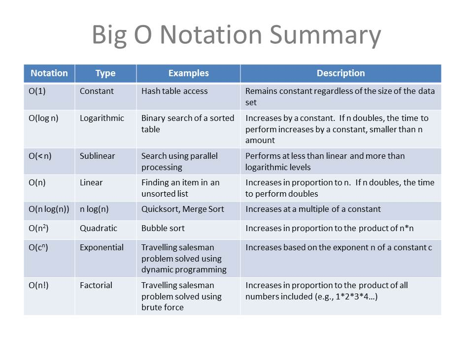
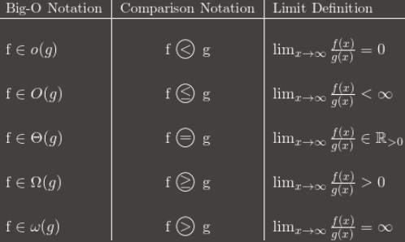
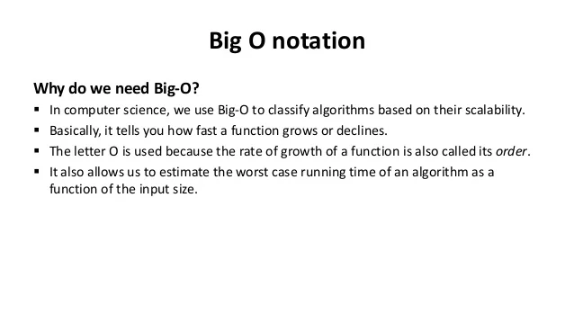

# Big O Notation

Big-O notation is a mathematical notation describing a function's limiting behavior when the argument goes towards a certain value or infinity. 

Big-O notation is used for the analysis of algorithms.

Big-O notation can be thought of as the highest limit for the algorithm's runtime. It therefore represents the algorithm's worst-case complexity.


The Types of Big-O Notation?
---------------------------------------



For algorithms, O(1) is usually known as a constant running time and is the fastest running time feasible. In this example, regardless of input size, the algorithm always takes the same time to be executed. This is ideal for an algorithm, but seldom is possible.\
The performance (runtime) of an algorithm with input in most practical circumstances will depend on n, i.e. the input size or number of operations for each input item.\
The best performance of the algorithms may be categorized as follows (Run Time Complexity)

-   *Logarithmic algorithm -- O(log(n)) Runtime grows logarithmically in proportion to n.*
-   *Linear algorithm -- O(n) Runtime grows directly in proportion to n.*
-   *Superlinear algorithm -- O(nlog(n)) Runtime grows in proportion to n.*
-   *Polynomial algorithm -- O(n^c) Runtime grows quicker than previous all based on n.*
-   *Exponential algorithm -- O(c^n) Runtime grows even faster than polynomial algorithm based on n.*
-   *Factorial algorithm -- O(n!) Runtime grows the fastest and becomes quickly unusable for even small values of n.*

The following chart shows the rate of growth for some Big-O notation representations.


How to express algorithmic complexity using the big-O notation
--------------------------------------------------------------

-   "Order 1" is a constant time/method: (1)
-   "Order N" is a linear function/method: O(N)
-   The "order N squared" is a quadratic-time feature/method: E. (N 2 )


**For Big-O runtime analysis, the following is the general approach**:

-   Identify what the input is and what n represents.
-   This method expresses the greatest number of operations in algorithm of n term.
-   Remove all excepting the top terms of order.
-   Remove all the elements constantly.

#### Dominating Term in Calculating Big O Complexity.

When we attempt to find the Big O complexity for a certain function g(n), the dominating term will take precidence because when the value of n increases, the other terms will have less of an impact on runtime.

So, if we have the following function g(n) = n^2 + 5n + 6, then O(n^2) would be the dominating term and take precidence. This is similar to determining limits for fractions of the polynomials if you have previously studied a calculus where you just worry about the dominating term for numerators and denominators at the conclusion of the process.




-   **O(1) has the least complexity**:- If you can build an algorithm in O(1) to solve an issue, you are generally in the best position, sometimes dubbed "constant time." The complexity in some cases can go above O(1), then evaluate it by obtaining O(1/g(n)). The O(1/n) is more difficult than the O(1/n2). For instance.
-   **O(log(n) is more intricate than O(1) but less intricate than polynomials**:- O(log(n)) is an useful complexity to sort algorithms since difficulty is typically connected to dividing and conquering methods. Because the square root function might be deemed polynomial when the exhibitor is 0,5 O(log(n)) is less difficult than O (file to n).
-   **Polynomial complexity grows with the increasing of the exponent**:- O(n5) is more sophisticated than O(n4, for instance). In fact, we have gone over a lot of polynomials in the preceding sections due to their simplicity.
-   **Exponentials are more complicated than polynomials while the coefficients are more positive than n**:- O(2n) is more complex than O(n99), although actually O(2n) is less difficult than O (1). We usually pick 2 as the basis for exponentials and logarithms since in computer science everything tend to be binary, although exponents may be modified by altering their coefficients. The logarithm base is presumed to be 2 if not specified.
-   **The complexity of factories is bigger than exponentials**:- Look up the gamma function if you are interested in the argument, it is an analytical continuation of a factorial. A quick evidence is, both factorial and exponential multiplications are the same, however for factorials numbers are increased and exponential numbers continue to rise.
-   **Multiplying terms**:- When multiplying, the complexity will be greater than the original, but no more than the equivalence of multiplying something that is more complex. For example, O(n * log(n)) is more complex than O(n) but less complex than O(n²), because O(n²) = O(n * n) and n is more complex than log(n).

Why **big O notation** is Important?
------------------------------------



It offers you an approximation of how the software will respond in response to being "scaled" to address major (more complicated) issues.

#### Examples of **Big-O Notation**?

**Example 1:** O(1)

```
function sumNumbers(n1, n2) {
  console.log(n1 + n2)
}

function printMultiple(n) {
  for (let i = 0; i < 10; i++) {
    console.log(i * n)
  }
}

var arr = [ 1,2,3,4,5];
arr[2]; // => 3
```
In the first line `function` (`sumNumbers`) contains two input values (n1 and n2), and the number of operations (just one operation is included in the function body) does not change, therefore the run-time does not rely on the input. It always takes place at a steady time -- O (1).

The second function (`printMultiple`) has a for loop, which is typically associated with non linear Big-O complexities. However, since the loop only runs 10 times, the runtime will be O(10) which is a constant Big-O complexity.


**Example 2:** O(n)

```
function loggingNumbers(n) {
  for (let i = 1; i <= n; i++) {
    console.log(n)
  }
}

function loggingNumbers2(n) {
  for (let i = 0; i < n; i++) {
    console.log(n)
  }

  for (let i = 0; i < n; i++) {
    console.log(n)
  }
}
```

O(n) specifies an algorithm who's runtime increases linearly in relation to the input size. 

The first `loggingNumbers` method uses an argument, and the log is controlling how much iterations the loop will run. The loop depends upon that argument. If we transmit 5, we'll get numbers from 1 to 5, if we send 10, we'll get numbers from 1 to 10, and so on. Because the output is connected to the input, this approach expands linearly -- O (n).

In the second `loggingNumbers2` method, with two loops running one after the other (they are not nested). Therefore, one runs at n, another runs at n, so the last run is O (2n). Or is it? Or is it that? Again the equation may be simplified, the constant removed, and merely O(n) may be used as runtime.

**Example 3:** O(n^2)

```
function multiplicationTable(n) {
  for (let i = 0; i <= n; i++) {
    for (let j = 0; j <= n; j++) {
      console.log(i * j);
    }
  }
}
```

There are two for loops in the `multiplicationTable` function, each itterating over n, which means that the total number of times that the operation will run will be n * n. *O(n^2)* is the runtime complexity. The execution time of the nested loops equals the number of loops that are nested, if we had 3 loops the runtime complexity will be *O(n^3)*. And so forth.

# References
https://www.devopsschool.com/blog/complete-tutorial-on-big-o-big-oh-notation/
