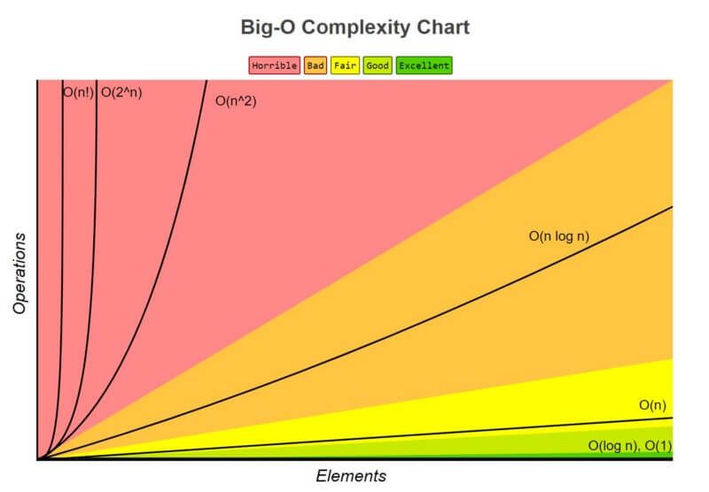

# Big O Notation

In this Tutorial I am going to cover Complete Tutorial on big O (big oh) notation. If you know something about Asymptotic Notations The big-O Notation is a part of it. But, If you don't know about the Asymptotic Notations don't worry i will cover this first then we will go to the next step that is big-O notation. So, let's start with the Asymptotic Notations.

What is Asymptotic Notations?
-----------------------------


Asymptotic Notations are the mathematical Notations used when the input tends towards a particular or a limiting value while describing the running duration of an algorithm.

The primary concept for asymptotic analysis is to analyze the effectiveness of algorithms not dependent on machine-specific constants and do not need to construct algorithms and spend the time to compare programmes. Asymptotic ratings describe the complexity of time of algorithms for asymptotic analysis as mathematical instruments.

The algorithm effectiveness and performance is described significantly by the asymptotic notation. It represents the time or space complexity behavior for large-scale features.

Example: in the bubble type, the time spent by the method is linear, i.e. the best situation, when the input array is already sorted.

However, the algoritm takes the greatest (quadratic) time to sort the elements, i.e. the worst case, when the input array has reverse effect.

If you don't sort or reverse the input array, then it requires average time. These lengths are indicated with asymptotic notes.

### How many types of Asymptotic Notations?


There are three Notations are commonly used. The three asymptotic Notations below are generally used to indicate algorithms' time complexity.

-   **Big-O notation** **(O)**
-   **Omega notation (Ω)**
-   **Theta notation** **(θ)**

What is **Big-O notation** **(O)**?
-----------------------------------


For the analysis of algorithms the big O notation is particularly significant. This notation must be understood soundly and how to apply it in the future. Throughout this part we will cover the large O notation.

Big O notation is a mathematical notation describing a function's limiting behavior when the argument goes towards a certain value or infinity. He belongs to a family of notes created by Paul Bachmann, Edmund Landau and others called the notation Bachmann-Landau or asymptotic notation.

Big-O is the highest limit for the algorithm's runtime. It therefore makes the algorithm's worst-case complexity.

How to express algorithmic complexity using the big-O notation
--------------------------------------------------------------

-   "Order 1" is a constant time/method: (1)
-   "Order N" is a linear function/method: O(N)
-   The "order N squared" is a quadratic-time feature/method: E. (N 2 )


```
O(g(n)) = { f(n): there exist positive constants c and n0
            such that 0 ≤ f(n) ≤ cg(n) for all n ≥ n0 }
```

If there is a positive (c) constant, that sits between (0) and cg(n) for sufficiently big "n," this expression may be characterised as a function that belongs to O(g(n)).

The runtime of an algorithm does not pass the time given by O(g(n) for any value of (n)

Given that an algorithm provides the worst case run time, it is often used to assess an algorithm since the worst-case situation is always an issue of our concern.

**For big-O runtime analysis, the following is the general approach**:

-   Identify what the input is and what n represents.
-   This method expresses the greatest number of operations in algorithm of n term.
-   Remove all excepting the top terms of order.
-   Remove all the elements constantly.

Which are the Types of  Big-O Notation?
---------------------------------------


We have largely used theoretical cycle complexity of algorithms in the performance study to quantify and compare the worst scenario.\
For every algorithm, O(1), usually known as constant running time, is the fastest running time feasible. In this example, regardless of input size, the algorithm takes always the same time to be executed. This is ideal for an algorithm, but seldom is possible.\
The performance (runtime) of a single input method in actual circumstances relies on n, i.e. the input size or number of operations for each input item.\
The best performance of the algorithms may be classed as follows (Running Time Complexity)

-   *A logarithmic algorithm -- O(logn) Runtime grows logarithmically in proportion to n. *
-   *A linear algorithm -- O(n) Runtime grows directly in proportion to n.*
-   *A superlinear algorithm -- O(nlogn) Runtime grows in proportion to n. *
-   *A polynomial algorithm -- O(n*c*) Runtime grows quicker than previous all based on n.*
-   *A exponential algorithm -- O(c*n*) Runtime grows even faster than polynomial algorithm based on n.*
-   *A factorial algorithm -- O(n!) Runtime grows the fastest and becomes quickly unusable for even small values of n. *

#### There are some Complexity Comparison in Big O's.

When we attempt to find the Big O for a certain function g(n), the dominating term is only important to us. The dominating term is the most quickly developed term.

So if we've got something like g(n) = n2 + 5n + 6, then it would be O(n2) bigger. This is extremely similar to determining limits for fractions of the polynomials if you have previously studied a calculus where you just worry about the dominating term for numerators and denominators at the conclusion of the process.


But one Question coms in your mind that Which is more rapidly growing function than the others? In fact, there are a number of regulations.



-   **O(1) has the less complexity**:- If you can build an algorithm in O(1) to solve the issue, you are generally in the best position, sometimes dubbed "constant time." The complexity in some cases can go above O(1), then evaluate it by obtaining O(1/g(n)). The O(1/n) is more difficult than the O(1/n2). For instance.
-   **O(log(n) is more intricate than O(1) but less intricate than polynomials**:- O(log(n)) is an useful complexity to sort algorithms since difficulty is typically connected to dividing and conquering methods. Because the square root function might be deemed polynomial when the exhibitor is 0,5 O(log(n)) is less difficult than O (file to n).
-   **Polynomial complexity grows with the increasing of the exponent**:- O(n5) is more sophisticated than O(n4, for instance). In fact, we have gone over a lot of polynomials in the preceding sections due to their simplicity.
-   **Exponentials are more complicated than polynomials while the coefficients are more positive than n**:- O(2n) is more complex than O(n99), although actually O(2n) is less difficult than O (1). We usually pick 2 as the basis for exponentials and logarithms since in computer science everything tend to be binary, although exponents may be modified by altering their coefficients. The logarithm base is presumed to be 2 if not specified.
-   **The complexity of factories is bigger than exponentials**:- Look up the gamma function if you are interested in the argument, it is an analytical continuation of a factorial. A quick evidence is, both factorial and exponential multiplications are the same, however for factorials numbers are increased and exponential numbers continue to rise.
-   **Multiplying terms**:- When multiplying, the complexity will be greater than the original, but no more than the equivalence of multiplying something that is more complex. For example, O(n * log(n)) is more complex than O(n) but less complex than O(n²), because O(n²) = O(n * n) and n is more complex than log(n).

Why **big O notation** is Important?
------------------------------------


It offers you an approximation of how the software will respond in response to being "scaled" to address major (more complicated) issues.

A program that scales linearly---that is, O(n) slows down, just like a line does, twice as many, four times the work, four times the work, and four times the length---a simple proportion.

A quadratic program, O(n2), is significantly faster than that, two times more time than work, four times longer. And the work is four times longer, seventeen times longer. It's around 10,000 times the length of work start to increase to 100 times.

Thus, when employed in production contexts in which the demands are too great, a program with O(n2) is becoming impossible. You can't chuck extra hardware to get it "faster" easy.

Even mild inputs become too huge when your software is O(2n). Add one additional item to the entry and twice the time. Two things are added and double again.

The second method is to double the amount of work that your software has to accomplish and it will only be a small percentage slower. O(1) indicates the issue size doesn't matter, it always takes the same amount of time to solve it.

#### Some Examples of **big O notation**?

**Example 1:-** O(1)

```
function sumNumbers(n1, n2) {
  console.log(n1 + n2)
}

function printMultiple(n) {
  for (let i = 0; i < 10; i++) {
    console.log(i * n)
  }
}

var arr = [ 1,2,3,4,5];
arr[2]; // => 3
```
In the first line `function` (`sumNumbers`) contains two input values (n1 and n2), and the number of operations (just one operation is included in the function body) does not change, therefore the run-time does not rely on the input. It always takes place at a steady time -- O (1).

The second function (`printMultiple`) sounds intriguing, we have a foor loop and have seen the correlation between a loop and a larger runtime. Well, it is not since the loop only runs 10 times, so again there are only 10 multiples (we may claim we have 10 operations, but we shall show that we can reduce the Big O expressions and the runtime will be O(1) again).

Now in next line Why is it always constant to access arrays? Due to the structuration of arrays, array items are in a continuous sequence of memory, thus any array item is calculated by performing just one operation, using a form -- memory address + item size * index.


**Example 2:-** O(n)

```
function loggingNumbers(n) {
  for (let i = 1; i <= n; i++) {
    console.log(n)
  }
}

function loggingNumbers2(n) {
  for (let i = 0; i < n; i++) {
    console.log(n)
  }

  for (let i = 0; i < n; i++) {
    console.log(n)
  }
}
```

O(n) specifies an algorithm which increases its performance directly and linearly in relation to the input size. The complexity of times rises as the size rises and at the same rate grows.

The first `loggingNumbers` method uses an argument, and the log is controlling how much iterations the loop will run. The loop depends upon that argument. If we transmit 5, we'll get numbers from 1 to 5, if we send 10, we'll get numbers from 1 to 10, and so on. Because the output is connected to the input, this approach expands linearly -- O (n).

In the second `loggingNumbers2` method, with two loops running one after the other (they are not nested). Therefore, one runs at n, another runs at n, so the last run is O (2n). Or is it? Or is it that? Again the equation may be simplified, the constant removed, and merely O(n) may be used as runtime.

**Example 3:-** *O(n*2*)*

```
function multiplicationTable(n) {
  for (let i = 0; i <= n; i++) {
    for (let j = 0; j <= n; j++) {
      console.log(i * j);
    }
  }
}
```

There are two methods in the `multiplicationTable` for loops, each is iterated over n, which means that n * n is total. *O(n*2*)* is the time to run. The execution time of the nested loops equals the number of loops that are nested, if we had 3 loops the execution time was *O(n*3*)*. And so forth. And so forth. Check the following visualization charts to show how much curve the runtime is at if the runtime is quadratic or cubic, such that the runtime grows with increasing the input, thereby reducing the efficiency of the procedure.

# References
https://www.devopsschool.com/blog/complete-tutorial-on-big-o-big-oh-notation/
