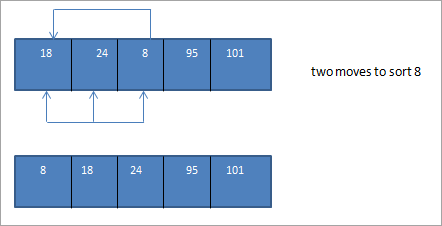

# Sorting Algorithms

Sorting is a technique that is implemented to arrange the data in a specific order. Sorting is required to ensure that the data which we use is in a particular order so that we can easily retrieve the required piece of information from the pile of data.

If the data is unkempt and unsorted, when we want a particular piece of information, then we will have to search it one by one every time to retrieve the data.

Thus it is always advisable that we keep our data arranged in a specific order so that information retrieval, as well as other operations performed on the data, can be done easily and efficiently.

We store data in the form of records. Each record is made up of one or more fields. When each record has a unique value of a particular field, we call it a key field. For Example, in a class, Roll No can be a unique or key field.

We can sort the data on a particular key field and then arrange it in ascending/increasing order or in a descending/decreasing order.

Similarly, in a telephone dictionary, every record consists of the name of a person, address and telephone number. In this, the telephone number is a unique or key field. We can sort the data of the dictionary on this telephone field. Alternatively, we can also sort data either numerically or alphanumerically.

When we can adjust the data to be sorted in the main memory itself without any need of another auxiliary memory, then we call it as Internal Sorting.

On the other hand, when we need auxiliary memory for storing intermediate data during sorting, then we call the technique as External Sorting.

*In this tutorial, we will learn the various sorting techniques in C++ in detail.*

What You Will Learn:

- Bubble Sort
- Selection Sort
- Insertion Sort
- Quick Sort
- Merge Sort
- Shell Sort
- Heap Sort
- Sorting Techniques In C++


### Bubble Sort

Bubble sort is the simplest technique in which we compare every element with its adjacent element and swap the elements if they are not in order. This way at the end of every iteration (called a pass), the heaviest element gets bubbled up at the end of the list.

Given below is an Example of Bubble Sort.

Array to be sorted:

[](assets/bubble-sort-array.png)

[](assets/bubble-sort-Pass1.png)

[](assets/bubble-sort-Pass2.png)

[](assets/bubble-sort-Pass3.png)

As seen above since it's a small array and was almost sorted, we managed to get a completely sorted array in a few passes.

Let us implement Bubble Sort technique in C++.

```
#include<iostream>  
using namespace std;
int main ()
{
   int i, j,temp;
   int a[5] = {10,2,0,43,12};
   cout <<"Input list ...\n";
   for(i = 0; i<5; i++) {
   cout <<a[i]<<"\t";
}
cout<<endl;
for(i = 0; i<5; i++) {
   for(j = i+1; j<5; j++)
   {
      if(a[j] < a[i]) {
         temp = a[i];
         a[i] = a[j];
         a[j] = temp;
      }
   }
}
cout <<"Sorted Element List ...\n";
for(i = 0; i<5; i++) {
   cout <<a[i]<<"\t";
   }
return 0;
}
```

Output:
```
Input list ...
10      2       0       43      12

Sorted Element List ...
0       2       10      12      43
```

As seen from the output, in bubble sort technique, with every pass the heaviest element is bubbled up to the end of the array thereby sorting the array completely.

### Selection Sort

It is simple yet easy to implement technique in which we find the smallest element in the list and put it in its proper place. At each pass, the next smallest element is selected and placed in its proper position.

Let us take the same array as in the previous example and perform Selection Sort to sort this array.

[](assets/Selection-Sort-array.png)

[](assets/Selection-Sort-Pass1.png)

[](assets/Selection-Sort-Pass2.png)

[](assets/Selection-Sort-Pass3.png)

As shown in the above illustration, for N number of elements we take N-1 passes to completely sort the array. At the end of every pass, the smallest element in the array is placed at its proper position in the sorted array.

Next, let us implement the Selection Sort using C++.

```
#include<iostream>
using namespace std;

int findSmallest (int[],int);
int main ()
{
   int myarray[5] = {12,45,8,15,33};
   int pos,temp;
   cout<<"\n Input list of elements to be Sorted\n";
   for(int i=0;i<5;i++)
   {
      cout<<myarray[i]<<"\t";
   }
   for(int i=0;i<5;i++)
   {
      pos = findSmallest (myarray,i);
      temp = myarray[i];
      myarray[i]=myarray[pos];
      myarray[pos] = temp;
   }
   cout<<"\n Sorted list of elements is\n";
   for(int i=0;i<5;i++)
   {
      cout<<myarray[i]<<"\t";
   }
return 0;
}
int findSmallest(int myarray[],int i)
{
   int ele_small,position,j;
   ele_small = myarray[i];
   position = i;
   for(j=i+1;j<5;j++)
   {
      if(myarray[j]<ele_small)
      {
      ele_small = myarray[j];
      position=j;
      }
   }
   return position;
}
```

Output:
```
Input list of elements to be Sorted
12      45      8       15      33

Sorted list of elements is
8       12      15      33      45
```

In selection sort, with every pass, the smallest element in the array is placed in its proper position. Hence at the end of the sorting process, we get a completely sorted array.

### Insertion Sort

Insertion sort is a technique in which we start from the second element of the list. We compare the second element to its previous (1st) element and place it in its proper place. In the next pass, for each element, we compare it to all its previous elements and insert that element at its proper place.

The above three sorting techniques are simple and easy to implement. These techniques perform well when the list size is smaller. As the list grows in size, these techniques do not perform that efficiently.

The technique will be clear by understanding the following illustration.

The array to be sorted is as follows:

[](assets/Insertion-Sort-rray.png)

Now for each pass, we compare the current element to all its previous elements. Thus in the first pass, we start with the second element.

[](assets/Insertion-Sort-Pass.png)

So we require N number of passes to completely sort an array containing N number of elements.

Let's implement the Insertion Sort technique using C++.

```
#include<iostream>
using namespace std;
int main ()
{
   int myarray[5] = { 12,4,3,1,15};
   cout<<"\nInput list is \n";
   for(int i=0;i<5;i++)
   {
      cout <<myarray[i]<<"\t";
   }
   for(int k=1; k<5; k++)
   {
      int temp = myarray[k];
      int j= k-1;
      while(j>=0 && temp <= myarray[j])
      {
         myarray[j+1] = myarray[j];
         j = j-1;
      }
   myarray[j+1] = temp;
   }
cout<<"\nSorted list is \n";
for(int i=0;i<5;i++)
   {
   cout <<myarray[i]<<"\t";
   }
}
```

Output:

```
Input list is
12      4       3       1       15

Sorted list is
1       3       4       12      15
```

The above output shows the complete sorted array using insertion sort.

### Quick Sort

Quicksort is the most efficient algorithm that can be used to sort the data. This technique uses the "divide and conquer" strategy in which the problem is divided into several subproblems and after solving these subproblems individually are merged together for a complete sorted list.

In quicksort, we first divide the list around the pivot element and then place the other elements in their proper positions according to the pivot element.

[](assets/Quick-Sort.png)

As shown in the above illustration, in Quicksort technique we divide the array around a pivot element such that all the elements lesser than the pivot are at its left which of those greater than the pivot are at its right. Then we take up these two arrays independently and sort them and then join or conquer them to get a resultant sorted array.

The key to Quicksort is the selection of the pivot element. It can be first, last or the middle element of the array. The first step after selecting the pivot element is to place the pivot in its correct position so that we can divide the array appropriately.

Let us implement the Quick Sort technique using C++.

```
#include <iostream>
using namespace std;
// Swap two elements - Utility function
void swap(int* a, int* b)
{
   int t = *a;
   *a = *b;
   *b = t;
}
// partition the array using last element as pivot
int partition (int arr[], int low, int high)
{
   int i = (low - 1);
   for (int j = low; j <= high- 1; j++)
  {
      //if current element is smaller than pivot, increment the low element
      //swap elements at i and j
      if (arr[j] <= pivot)
      {
         i++; // increment index of smaller element
         swap(&arr[i], &arr[j]);
      }
   }
swap(&arr[i + 1], &arr[high]);
return (i + 1);
}

//quicksort algorithm
void quickSort(int arr[], int low, int high)
{
if (low < high)
   {
   //partition the array
    int pivot = partition(arr, low, high);
   //sort the sub arrays independently
   quickSort(arr, low, pivot - 1);
   quickSort(arr, pivot + 1, high);
   }
}
void displayArray(int arr[], int size)
  {
   int i;
   for (i=0; i < size; i++)
   cout<<arr[i]<<"\t";
   }
int main()
{
   int arr[] = {12,23,3,43,51};
   int n = sizeof(arr)/sizeof(arr[0]);
   cout<<"Input array"<<endl;
   displayArray(arr,n);
   cout<<endl;
   quickSort(arr, 0, n-1);
   cout<<"Array sorted with quick sort"<<endl;
   displayArray(arr,n);
   return 0;
}
```

Output:
```
Input array
12      23      3       43      51

Array sorted with Quicksort
3       12      23      43      51
```

In the quicksort implementation above, we have a partition routine which is used to partition the input array around a pivot element which is the last element in the array. Then we call the quicksort routine recursively to individually sort the sub-arrays as shown in the illustration.

### Merge Sort

This is another technique that uses the "Divide and conquer" strategy. In this technique, we divide the list first into equal halves. Then we perform merge sort technique on these lists independently so that both the lists are sorted. Finally, we merge both the lists to get a complete sorted list.

Merge sort and quick sort are faster than most other sorting techniques. Their performance remains intact even when the list grows bigger in size.

Let us see an illustration of Merge Sort technique.

[](assets/Merge-Sort.png)

In the above illustration, we see that the merge sort technique divides the original array into subarrays repeatedly until there is only one element in each subarray. Once this is done, the subarrays are then sorted independently and merged together to form a complete sorted array.

Next, let us implement Merge Sort using C++ language.

```
#include <iostream>
using namespace std;
void merge(int *,int, int , int );
void merge_sort(int *arr, int low, int high)
{
   int mid;
   if (low < high){
      //divide the array at mid and sort independently using merge sort
      mid=(low+high)/2;
      merge_sort(arr,low,mid);
      merge_sort(arr,mid+1,high);
      //merge or conquer sorted arrays
      merge(arr,low,high,mid);
   }
}
// Merge sort
void merge(int *arr, int low, int high, int mid)
{
   int i, j, k, c[50];
   i = low;
   k = low;
   j = mid + 1;
   while (i <= mid && j <= high) {
   if (arr[i] < arr[j]) {
   c[k] = arr[i];
   k++;
   i++;
}
else {
   c[k] = arr[j];
   k++;
   j++;
   }
}

while (i <= mid) {
   c[k] = arr[i];
   k++;
   i++;
}
while (j <= high) {
   c[k] = arr[j];
   k++;
   j++;
}
for (i = low; i < k; i++) {
   arr[i] = c[i];
}
}
// read input array and call mergesort
int main()
{
int myarray[30], num;
cout<<"Enter number of elements to be sorted:";
cin>>num;
cout<<"Enter "<<num<<" elements to be sorted:";
for (int i = 0; i < num; i++) { cin>>myarray[i];
}
merge_sort(myarray, 0, num-1);
cout<<"Sorted array\n";
for (int i = 0; i < num; i++)
{
   cout<<myarray[i]<<"\t";
}
}
```

Output:
```
Enter number of elements to be sorted:5

Enter 5 elements to be sorted:10 21 47 3 59

Sorted array
3       10      21      47      59
```

### Shell Sort

Shell sort is an extension of the insertion sort technique. In Insertion sort, we only deal with the next element whereas, in shell sort, we provide an increment or a gap using which we create smaller lists from the parent list. The elements in the sublists need not be contiguous, rather they are usually 'gap_value' apart.

Shell sort performs faster than the Insertion sort and requires fewer moves than that of Insertion sort.


If we provide a gap of, then we will have the following sub-lists with each element that is 3 elements apart.

We then sort these three sublists.


The above array that we have obtained after merging the sorted sub-arrays is nearly sorted. Now we can perform insertion sort on this array to sort the entire array.



Thus we see that once we divide the array into sublists using the appropriate increment and then merge them together we get the nearly sorted list. The insertion sort technique on this list can be performed and the array is sorted in fewer moves than the original insertion sort.

Given below is the implementation of the Shell Sort in C++.

```
#include <iostream>
using namespace std;

// shellsort implementation
int shellSort(int arr[], int N)
{
for (int gap = N/2; gap > 0; gap /= 2) {
 for (int i = gap; i < N; i += 1) {
      //sort sub lists created by applying gap
int temp = arr[i];
int j;
for (j = i; j >= gap && arr[j - gap] > temp; j -= gap)
arr[j] = arr[j - gap];

      arr[j] = temp;
   }
}
return 0;
}

int main()
{
int arr[] = {45,23,53,43,18};
   //Calculate size of array
int N = sizeof(arr)/sizeof(arr[0]);

 cout << "Array to be sorted: \n";
 for (int i=0; i<N; i++)
 cout << arr[i] << " ";

 shellSort(arr, N);

cout << "\nArray after shell sort: \n";
for (int i=0; i<N; i++)
cout << arr[i] << " ";

 return 0;
}
```

Output:
```
Array to be sorted:
45    23    53   43   18

Array after shell sort:
18    23    43    45   53
```

Shell sort thus acts as a huge improvement over insertion sort and doesn't even take half the number of steps to sort the array.

### Heap Sort

Heapsort is a technique in which heap data structure (min-heap or max-heap) is used to sort the list. We first construct a heap from the unsorted list and also use the heap to sort the array.

Heapsort is efficient but not as quick or the Merge sort.


As shown in the above illustration, we first construct a max heap out of the array elements to be sorted. Then we traverse the heap and swap the last and first element. At this time the last element is already sorted. Then we again construct a max heap out of the remaining elements.

Again traverse the heap and swap the first and last elements and add the last element to the sorted list. This process is continued until there is only one element left in the heap which becomes the first element of the sorted list.

Let us now implement Heap Sort using C++.

```
#include <iostream>
using namespace std;

// function to heapify the tree
void heapify(int arr[], int n, int root)
{
int largest = root; // root is the largest element
int l = 2*root + 1; // left = 2*root + 1
int r = 2*root + 2; // right = 2*root + 2

   // If left child is larger than root
if (l < n && arr[l] > arr[largest])
largest = l;

   // If right child is larger than largest so far
if (r < n && arr[r] > arr[largest])
largest = r;

   // If largest is not root
if (largest != root)
   {
      //swap root and largest
swap(arr[root], arr[largest]);

      // Recursively heapify the sub-tree
heapify(arr, n, largest);
   }
}

// implementing heap sort
void heapSort(int arr[], int n)
{
   // build heap
for (int i = n / 2 - 1; i >= 0; i--)
heapify(arr, n, i);

   // extracting elements from heap one by one
for (int i=n-1; i>=0; i--)
   {
      // Move current root to end
swap(arr[0], arr[i]);

      // again call max heapify on the reduced heap
heapify(arr, i, 0);
   }
}

/* print contents of array - utility function */
void displayArray(int arr[], int n)
{
   for (int i=0; i<n; ++i)
   cout << arr[i] << " ";
   cout << "\n";
}

// main program
int main()
{
int heap_arr[] = {4,17,3,12,9};
int n = sizeof(heap_arr)/sizeof(heap_arr[0]);
cout<<"Input array"<<endl;
displayArray(heap_arr,n);

heapSort(heap_arr, n);

cout << "Sorted array"<<endl;
displayArray(heap_arr, n);
}
```

Output:
```
Input array
4    17     3    12   9

Sorted array
3    4     9     12    17
```

So far we have briefly discussed all the major sorting techniques with an illustration. We will learn each of these techniques in detail in our subsequent tutorials along with various examples to understand each technique.

### Conclusion

Sorting is required to keep the data sorted and in proper order. Unsorted and unkempt may take a longer time to access and thus might hit the performance of the entire program. Thus for any operations related to data like accessing, searching, manipulation, etc., we need the data to be sorted.

There are many sorting techniques employed in programming. Each technique can be employed depending on the data structure that we are using or the time taken by the algorithm to sort the data or memory space taken by the algorithm to sort the data. The technique that we are using also depends on which data structure we are sorting.

The sorting techniques allow us to sort our data structures in a specific order and arrange the elements either in ascending or descending order. We have seen the sorting techniques like the Bubble sort, Selection sort, Insertion sort, Quicksort, Shell sort, Merge sort and Heap sort. Bubble sort and Selection sort are simpler and easier to implement.

# References
https://www.softwaretestinghelp.com/sorting-techniques-in-cpp/
