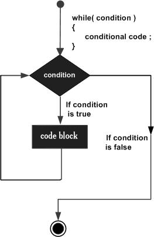
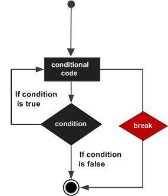
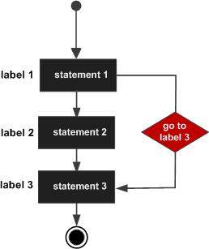

# C++ Loops

There may be a situation, when you need to execute a block of code several number of times. In general, statements are executed sequentially: The first statement in a function is executed first, followed by the second, and so on.

Programming languages provide various control structures that allow for more complicated execution paths.

A loop statement allows us to execute a statement or group of statements multiple times and following is the general from of a loop statement in most of the programming languages −


C++ programming language provides the following type of loops to handle looping requirements.


## while loop
Repeats a statement or group of statements while a given condition is true. It tests the condition before executing the loop body.

A while loop statement repeatedly executes a target statement as long as a given condition is true.

Syntax
The syntax of a while loop in C++ is −

while(condition) {
   statement(s);
}
Here, statement(s) may be a single statement or a block of statements. The condition may be any expression, and true is any non-zero value. The loop iterates while the condition is true.

When the condition becomes false, program control passes to the line immediately following the loop.




Here, key point of the while loop is that the loop might not ever run. When the condition is tested and the result is false, the loop body will be skipped and the first statement after the while loop will be executed.

```
#include <iostream>
using namespace std;

int main () {
   // Local variable declaration:
   int a = 10;

   // while loop execution
   while( a < 20 ) {
      cout << "value of a: " << a << endl;
      a++;
   }

   return 0;
}
```
When the above code is compiled and executed, it produces the following result −
```
value of a: 10
value of a: 11
value of a: 12
value of a: 13
value of a: 14
value of a: 15
value of a: 16
value of a: 17
value of a: 18
value of a: 19
```
##	for loop
Execute a sequence of statements multiple times and abbreviates the code that manages the loop variable.

A for loop is a repetition control structure that allows you to efficiently write a loop that needs to execute a specific number of times.

**Syntax**

The syntax of a for loop in C++ is −
```
for ( init; condition; increment ) {
   statement(s);
}
```
Here is the flow of control in a for loop −

The init step is executed first, and only once. This step allows you to declare and initialize any loop control variables. You are not required to put a statement here, as long as a semicolon appears.

Next, the condition is evaluated. If it is true, the body of the loop is executed. If it is false, the body of the loop does not execute and flow of control jumps to the next statement just after the for loop.

After the body of the for loop executes, the flow of control jumps back up to the increment statement. This statement can be left blank, as long as a semicolon appears after the condition.

The condition is now evaluated again. If it is true, the loop executes and the process repeats itself (body of loop, then increment step, and then again condition). After the condition becomes false, the for loop terminates.


**Example**
```
#include <iostream>
using namespace std;

int main () {
   // for loop execution
   for( int a = 10; a < 20; a = a + 1 ) {
      cout << "value of a: " << a << endl;
   }

   return 0;
}
```
When the above code is compiled and executed, it produces the following result −
```
value of a: 10
value of a: 11
value of a: 12
value of a: 13
value of a: 14
value of a: 15
value of a: 16
value of a: 17
value of a: 18
value of a: 19
```
##	do...while loop
Like a ‘while’ statement, except that it tests the condition at the end of the loop body.

Unlike for and while loops, which test the loop condition at the top of the loop, the do...while loop checks its condition at the bottom of the loop.

A do...while loop is similar to a while loop, except that a do...while loop is guaranteed to execute at least one time.

Syntax
The syntax of a do...while loop in C++ is −
```
do {
   statement(s);
}
while( condition );
```
Notice that the conditional expression appears at the end of the loop, so the statement(s) in the loop execute once before the condition is tested.

If the condition is true, the flow of control jumps back up to do, and the statement(s) in the loop execute again. This process repeats until the given condition becomes false.


**Example**
```
#include <iostream>
using namespace std;

int main () {
   // Local variable declaration:
   int a = 10;

   // do loop execution
   do {
      cout << "value of a: " << a << endl;
      a = a + 1;
   } while( a < 20 );

   return 0;
}
```
When the above code is compiled and executed, it produces the following result −
```
value of a: 10
value of a: 11
value of a: 12
value of a: 13
value of a: 14
value of a: 15
value of a: 16
value of a: 17
value of a: 18
value of a: 19
```

##	nested loops
You can use one or more loop inside any another ‘while’, ‘for’ or ‘do..while’ loop.

A loop can be nested inside of another loop. C++ allows at least 256 levels of nesting.

**Syntax**

The syntax for a nested for loop statement in C++ is as follows −
```
for ( init; condition; increment ) {
   for ( init; condition; increment ) {
      statement(s);
   }
   statement(s); // you can put more statements.
}
```
The syntax for a nested while loop statement in C++ is as follows −
```
while(condition) {
   while(condition) {
      statement(s);
   }
   statement(s); // you can put more statements.
}
```
The syntax for a nested do...while loop statement in C++ is as follows −
```
do {
   statement(s); // you can put more statements.
   do {
      statement(s);
   } while( condition );

} while( condition );
```

**Example**

The following program uses a nested for loop to find the prime numbers from 2 to 100 −

```
#include <iostream>
using namespace std;

int main () {
   int i, j;

   for(i = 2; i<100; i++) {
      for(j = 2; j <= (i/j); j++)
         if(!(i%j)) break; // if factor found, not prime
         if(j > (i/j)) cout << i << " is prime\n";
   }

   return 0;
}
```
This would produce the following result −
```
2 is prime
3 is prime
5 is prime
7 is prime
11 is prime
13 is prime
17 is prime
19 is prime
23 is prime
29 is prime
31 is prime
37 is prime
41 is prime
43 is prime
47 is prime
53 is prime
59 is prime
61 is prime
67 is prime
71 is prime
73 is prime
79 is prime
83 is prime
89 is prime
97 is prime
```

## Loop Control Statements
Loop control statements change execution from its normal sequence. When execution leaves a scope, all automatic objects that were created in that scope are destroyed.

C++ supports the following control statements.

## break statement
Terminates the loop or switch statement and transfers execution to the statement immediately following the loop or switch.

The break statement has the following two usages in C++ −

- When the break statement is encountered inside a loop, the loop is immediately terminated and program control resumes at the next statement following the loop.

- It can be used to terminate a case in the switch statement (covered in the next chapter).

If you are using nested loops (i.e., one loop inside another loop), the break statement will stop the execution of the innermost loop and start executing the next line of code after the block.

**Syntax**

The syntax of a break statement in C++ is −
```
break;
```



**Example**

 ```
#include <iostream>
using namespace std;

int main () {
   // Local variable declaration:
   int a = 10;

   // do loop execution
   do {
      cout << "value of a: " << a << endl;
      a = a + 1;
      if( a > 15) {
         // terminate the loop
         break;
      }
   } while( a < 20 );

   return 0;
}
```
When the above code is compiled and executed, it produces the following result −
```
value of a: 10
value of a: 11
value of a: 12
value of a: 13
value of a: 14
value of a: 15
```

##	continue statement
Causes the loop to skip the remainder of its body and immediately retest its condition prior to reiterating.

The continue statement works somewhat like the break statement. Instead of forcing termination, however, continue forces the next iteration of the loop to take place, skipping any code in between.

For the for loop, continue causes the conditional test and increment portions of the loop to execute. For the while and do...while loops, program control passes to the conditional tests.

**Syntax**
The syntax of a continue statement in C++ is −
```
continue;
```


**Example**
```
#include <iostream>
using namespace std;

int main () {
   // Local variable declaration:
   int a = 10;

   // do loop execution
   do {
      if( a == 15) {
         // skip the iteration.
         a = a + 1;
         continue;
      }
      cout << "value of a: " << a << endl;
      a = a + 1;
   }
   while( a < 20 );

   return 0;
}
```
When the above code is compiled and executed, it produces the following result −
```
value of a: 10
value of a: 11
value of a: 12
value of a: 13
value of a: 14
value of a: 16
value of a: 17
value of a: 18
value of a: 19
```

##	goto statement
Transfers control to the labeled statement. Though it is not advised to use goto statement in your program.

A goto statement provides an unconditional jump from the goto to a labeled statement in the same function.

NOTE − Use of goto statement is highly discouraged because it makes difficult to trace the control flow of a program, making the program hard to understand and hard to modify. Any program that uses a goto can be rewritten so that it doesn't need the goto.

**Syntax**

The syntax of a goto statement in C++ is −
```
goto label;
..
.
label: statement;
```
Where label is an identifier that identifies a labeled statement. A labeled statement is any statement that is preceded by an identifier followed by a colon (:).



**Example**
```
#include <iostream>
using namespace std;

int main () {
   // Local variable declaration:
   int a = 10;

   // do loop execution
   LOOP:do {
      if( a == 15) {
         // skip the iteration.
         a = a + 1;
         goto LOOP;
      }
      cout << "value of a: " << a << endl;
      a = a + 1;
   }
   while( a < 20 );

   return 0;
}
```
When the above code is compiled and executed, it produces the following result −
```
value of a: 10
value of a: 11
value of a: 12
value of a: 13
value of a: 14
value of a: 16
value of a: 17
value of a: 18
value of a: 19
```
One good use of goto is to exit from a deeply nested routine. For example, consider the following code fragment −
```
for(...) {
   for(...) {
      while(...) {
         if(...) goto stop;
         .
         .
         .
      }
   }
}
stop:
cout << "Error in program.\n";
```
Eliminating the goto would force a number of additional tests to be performed. A simple break statement would not work here, because it would only cause the program to exit from the innermost loop.

## The Infinite Loop
A loop becomes infinite loop if a condition never becomes false. The for loop is traditionally used for this purpose. Since none of the three expressions that form the ‘for’ loop are required, you can make an endless loop by leaving the conditional expression empty.
```
#include <iostream>
using namespace std;

int main () {
   for( ; ; ) {
      printf("This loop will run forever.\n");
   }

   return 0;
}
```
When the conditional expression is absent, it is assumed to be true. You may have an initialization and increment expression, but C++ programmers more commonly use the ‘for (;;)’ construct to signify an infinite loop.

NOTE − You can terminate an infinite loop by pressing Ctrl + C keys.

# References
https://www.tutorialspoint.com/cplusplus/cpp_loop_types.htm
