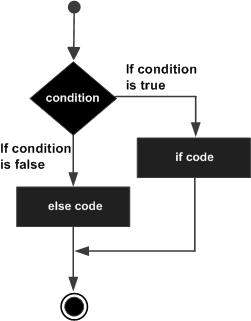

# Decision Making

Decision making structures require that the programmer specify one or more conditions to be evaluated or tested by the program, along with a statement or statements to be executed if the condition is determined to be true, and optionally, other statements to be executed if the condition is determined to be false.

Following is the general form of a typical decision making structure found in most of the programming languages −


## C++ decision making
C++ programming language provides following types of decision making statements.

## if statement
An ‘if’ statement consists of a boolean expression followed by one or more statements.

An if statement consists of a boolean expression followed by one or more statements.

**Syntax**

The syntax of an if statement in C++ is −
```
if(boolean_expression) {
   // statement(s) will execute if the boolean expression is true
}
```
If the boolean expression evaluates to true, then the block of code inside the if statement will be executed. If boolean expression evaluates to false, then the first set of code after the end of the if statement (after the closing curly brace) will be executed.


**Example**
```
#include <iostream>
using namespace std;

int main () {
   // local variable declaration:
   int a = 10;

   // check the boolean condition
   if( a < 20 ) {
      // if condition is true then print the following
      cout << "a is less than 20;" << endl;
   }
   cout << "value of a is : " << a << endl;

   return 0;
}
```
When the above code is compiled and executed, it produces the following result −
```
a is less than 20;
value of a is : 10
```

## 2	if...else statement
An ‘if’ statement can be followed by an optional ‘else’ statement, which executes when the boolean expression is false.

An if statement can be followed by an optional else statement, which executes when the boolean expression is false.

**Syntax**

The syntax of an if...else statement in C++ is −
```
if(boolean_expression) {
   // statement(s) will execute if the boolean expression is true
} else {
  // statement(s) will execute if the boolean expression is false
}
```
If the boolean expression evaluates to true, then the if block of code will be executed, otherwise else block of code will be executed.




**Example**
```
#include <iostream>
using namespace std;

int main () {
   // local variable declaration:
   int a = 100;

   // check the boolean condition
   if( a < 20 ) {
      // if condition is true then print the following
      cout << "a is less than 20;" << endl;
   } else {
      // if condition is false then print the following
      cout << "a is not less than 20;" << endl;
   }
   cout << "value of a is : " << a << endl;

   return 0;
}
```
When the above code is compiled and executed, it produces the following result −
```
a is not less than 20;
value of a is : 100
```

## if...else if...else Statement
An if statement can be followed by an optional else if...else statement, which is very usefull to test various conditions using single if...else if statement.

When using if , else if , else statements there are few points to keep in mind.

An if can have zero or one else's and it must come after any else if's.

An if can have zero to many else if's and they must come before the else.

Once an else if succeeds, none of he remaining else if's or else's will be tested.

**Syntax**

The syntax of an if...else if...else statement in C++ is −
```
if(boolean_expression 1) {
   // Executes when the boolean expression 1 is true
} else if( boolean_expression 2) {
   // Executes when the boolean expression 2 is true
} else if( boolean_expression 3) {
   // Executes when the boolean expression 3 is true
} else {
   // executes when the none of the above condition is true.
}
```

**Example**
```
#include <iostream>
using namespace std;

int main () {
   // local variable declaration:
   int a = 100;

   // check the boolean condition
   if( a == 10 ) {
      // if condition is true then print the following
      cout << "Value of a is 10" << endl;
   } else if( a == 20 ) {
      // if else if condition is true
      cout << "Value of a is 20" << endl;
   } else if( a == 30 ) {
      // if else if condition is true
      cout << "Value of a is 30" << endl;
   } else {
      // if none of the conditions is true
      cout << "Value of a is not matching" << endl;
   }
   cout << "Exact value of a is : " << a << endl;

   return 0;
}
```
When the above code is compiled and executed, it produces the following result −
```
Value of a is not matching
Exact value of a is : 100
```

##	switch statement
A ‘switch’ statement allows a variable to be tested for equality against a list of values.

A switch statement allows a variable to be tested for equality against a list of values. Each value is called a case, and the variable being switched on is checked for each case.

**Syntax**

The syntax for a switch statement in C++ is as follows −
```
switch(expression) {
   case constant-expression  :
      statement(s);
      break; //optional
   case constant-expression  :
      statement(s);
      break; //optional

   // you can have any number of case statements.
   default : //Optional
      statement(s);
}
```
The following rules apply to a switch statement −

The expression used in a switch statement must have an integral or enumerated type, or be of a class type in which the class has a single conversion function to an integral or enumerated type.

You can have any number of case statements within a switch. Each case is followed by the value to be compared to and a colon.

The constant-expression for a case must be the same data type as the variable in the switch, and it must be a constant or a literal.

When the variable being switched on is equal to a case, the statements following that case will execute until a break statement is reached.

When a break statement is reached, the switch terminates, and the flow of control jumps to the next line following the switch statement.

Not every case needs to contain a break. If no break appears, the flow of control will fall through to subsequent cases until a break is reached.

A switch statement can have an optional default case, which must appear at the end of the switch. The default case can be used for performing a task when none of the cases is true. No break is needed in the default case.


**Example**
```
#include <iostream>
using namespace std;

int main () {
   // local variable declaration:
   char grade = 'D';

   switch(grade) {
      case 'A' :
         cout << "Excellent!" << endl;
         break;
      case 'B' :
      case 'C' :
         cout << "Well done" << endl;
         break;
      case 'D' :
         cout << "You passed" << endl;
         break;
      case 'F' :
         cout << "Better try again" << endl;
         break;
      default :
         cout << "Invalid grade" << endl;
   }
   cout << "Your grade is " << grade << endl;

   return 0;
}
```
This would produce the following result −
```
You passed
Your grade is D
```

##	nested if statements
You can use one ‘if’ or ‘else if’ statement inside another ‘if’ or ‘else if’ statement(s).

It is always legal to nest if-else statements, which means you can use one if or else if statement inside another if or else if statement(s).

**Syntax**

The syntax for a nested if statement is as follows −
```
if( boolean_expression 1) {
   // Executes when the boolean expression 1 is true
   if(boolean_expression 2) {
      // Executes when the boolean expression 2 is true
   }
}
```
You can nest else if...else in the similar way as you have nested if statement.

**Example**
```
#include <iostream>
using namespace std;

int main () {
   // local variable declaration:
   int a = 100;
   int b = 200;

   // check the boolean condition
   if( a == 100 ) {
      // if condition is true then check the following
      if( b == 200 ) {
         // if condition is true then print the following
         cout << "Value of a is 100 and b is 200" << endl;
      }
   }
   cout << "Exact value of a is : " << a << endl;
   cout << "Exact value of b is : " << b << endl;

   return 0;
}
```
When the above code is compiled and executed, it produces the following result −
```
Value of a is 100 and b is 200
Exact value of a is : 100
Exact value of b is : 200
```

##	nested switch statements
You can use one ‘switch’ statement inside another ‘switch’ statement(s).

It is possible to have a switch as part of the statement sequence of an outer switch. Even if the case constants of the inner and outer switch contain common values, no conflicts will arise.

C++ specifies that at least 256 levels of nesting be allowed for switch statements.

**Syntax**

The syntax for a nested switch statement is as follows −
```
switch(ch1) {
   case 'A':
      cout << "This A is part of outer switch";
      switch(ch2) {
         case 'A':
            cout << "This A is part of inner switch";
            break;
         case 'B': // ...
      }
      break;
   case 'B': // ...
}
```

**Example**
```
#include <iostream>
using namespace std;

int main () {
   // local variable declaration:
   int a = 100;
   int b = 200;

   switch(a) {
      case 100:
         cout << "This is part of outer switch" << endl;
         switch(b) {
            case 200:
               cout << "This is part of inner switch" << endl;
         }
   }
   cout << "Exact value of a is : " << a << endl;
   cout << "Exact value of b is : " << b << endl;

   return 0;
}
```
This would produce the following result −
```
This is part of outer switch
This is part of inner switch
Exact value of a is : 100
Exact value of b is : 200
```

## The ? : Ternary Operator
We have covered conditional operator “? :” in previous chapter which can be used to replace if...else statements. It has the following general form −
```
Exp1 ? Exp2 : Exp3;
```
Exp1, Exp2, and Exp3 are expressions. Notice the use and placement of the colon.

The value of a ‘?’ expression is determined like this: Exp1 is evaluated. If it is true, then Exp2 is evaluated and becomes the value of the entire ‘?’ expression. If Exp1 is false, then Exp3 is evaluated and its value becomes the value of the expression.

# References
https://www.tutorialspoint.com/cplusplus/cpp_decision_making.htm
