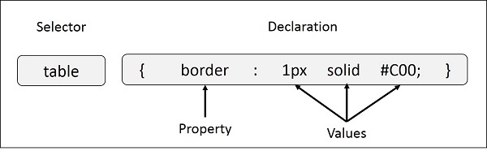

# CSS Syntax

A CSS comprises of style rules that are interpreted by the browser and then applied to the corresponding elements in your document. A style rule is made of three parts −

- **Selector** − A selector is an HTML tag at which a style will be applied. This could be any tag like `<h1>` or `<table>` etc.

- **Property** − A property is a type of attribute of HTML tag. Put simply, all the HTML attributes are converted into CSS properties. They could be color, border etc.

- **Value** − Values are assigned to properties. For example, color property can have value either red or #F1F1F1 etc.

You can put CSS Style Rule Syntax as follows −
```
selector { property: value }
```



**Example** − You can define a table border as follows −
```
table{ border :1px solid #C00; }
```
Here table is a selector and border is a property and given value 1px solid #C00 is the value of that property.

You can define selectors in various simple ways based on your comfort. Let me put these selectors one by one.

## The Type Selectors
This is the same selector we have seen above. Again, one more example to give a color to all level 1 headings −
```
h1 {
   color: #36CFFF;
}
```

## The Universal Selectors
Rather than selecting elements of a specific type, the universal selector quite simply matches the name of any element type −
```
* {
   color: #000000;
}
```
This rule renders the content of every element in our document in black.

## The Descendant Selectors

Suppose you want to apply a style rule to a particular element only when it lies inside a particular element. As given in the following example, style rule will apply to `<em>` element only when it lies inside `<ul>` tag.
```
ul em {
   color: #000000;
}
```

## The Class Selectors

You can define style rules based on the class attribute of the elements by prepending a dot (`.`) to the class name of selector. All the elements having that class will be formatted according to the defined rule.
```
.black {
   color: #000000;
}
This rule renders the content in black for every element with class attribute set to black in our document. You can make it a bit more particular. For example −

h1.black {
   color: #000000;
}
```

This rule renders the content in black for only `<h1>` elements with class attribute set to black.

You can apply more than one class selectors to given element. Consider the following example −
```
<p class = "center bold">
   This para will be styled by the classes center and bold.
</p>
```

## The ID Selectors

You can define style rules based on the id attribute of the elements by prepending a hash (`#`) to the id value of selector. All the elements having that id will be formatted according to the defined rule.
```
#black {
   color: #000000;
}
```
This rule renders the content in black for every element with id attribute set to black in our document. You can make it a bit more particular. For example −
```
h1#black {
   color: #000000;
}
```
This rule renders the content in black for only `<h1>` elements with id attribute set to black.

The true power of id selectors is when they are used as the foundation for descendant selectors, For example −
```
#black h2 {
   color: #000000;
}
```
In this example all level 2 headings will be displayed in black color when those headings will lie with in tags having id attribute set to black.

The Child Selectors
You have seen the descendant selectors. There is one more type of selector, which is very similar to descendants but have different functionality. Consider the following example −
```
body > p {
   color: #000000;
}
```
This rule will render all the paragraphs in black if they are direct child of `<body>` element. Other paragraphs put inside other elements like `<div>` or `<td>` would not have any effect of this rule.

## The Attribute Selectors
You can also apply styles to HTML elements with particular attributes. The style rule below will match all the input elements having a type attribute with a value of text −
```
input[type = "text"] {
   color: #000000;
}
```
The advantage to this method is that the `<input type = "submit" />` element is unaffected, and the color applied only to the desired text fields.

There are following rules applied to attribute selector.

- **p[lang]** − Selects all paragraph elements with a lang attribute.

- **p[lang="fr"]** − Selects all paragraph elements whose lang attribute has a value of exactly "fr".

- **p[lang~="fr"]** − Selects all paragraph elements whose lang attribute contains the word "fr".

- **p[lang|="en"]** − Selects all paragraph elements whose lang attribute contains values that are exactly "en", or begin with "en-".

## Multiple Style Rules
You may need to define multiple style rules for a single element. You can define these rules to combine multiple properties and corresponding values into a single block as defined in the following example −
```
h1 {
   color: #36C;
   font-weight: normal;
   letter-spacing: .4em;
   margin-bottom: 1em;
   text-transform: lowercase;
}
```

Here all the property and value pairs are separated by a **semicolon (;)**. You can keep them in a single line or multiple lines. For better readability, we keep them in separate lines.

For a while, don't bother about the properties mentioned in the above block. These properties will be explained in the coming chapters and you can find complete detail about properties in CSS References

## Grouping Selectors
You can apply a style to many selectors if you like. Just separate the selectors with a comma, as given in the following example −
```
h1, h2, h3 {
   color: #36C;
   font-weight: normal;
   letter-spacing: .4em;
   margin-bottom: 1em;
   text-transform: lowercase;
}
```
This define style rule will be applicable to h1, h2 and h3 element as well. The order of the list is irrelevant. All the elements in the selector will have the corresponding declarations applied to them.

You can combine the various id selectors together as shown below −
```
#content, #footer, #supplement {
   position: absolute;
   left: 510px;
   width: 200px;
}
```

# References
https://www.tutorialspoint.com/css/css_syntax.htm
