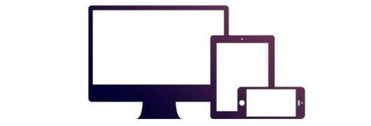

# CSS Frameworks

## Bootstrap

Bootstrap is the most popular front end framework in the recent time. It is sleek, intuitive, and powerful mobile first front-end framework for faster and easier web development. It uses HTML, CSS and Javascript. This tutorial will teach you the basics of Bootstrap Framework using which you can create web projects with ease. The tutorial is divided into sections such as Bootstrap Basic Structure, Bootstrap CSS, Bootstrap Layout Components and Bootstrap Plugins. Each of these sections contain related topics with simple and useful examples.

### Why to Learn Bootstrap?

**Mobile first approach** − Bootstrap 3, framework consists of Mobile first styles throughout the entire library instead them of in separate files.

**Browser Support** − It is supported by all popular browsers.


**Easy to get started** − With just the knowledge of HTML and CSS anyone can get started with Bootstrap. Also the Bootstrap official site has a good documentation.

**Responsive design** − Bootstrap's responsive CSS adjusts to Desktops, Tablets and Mobiles. More about the responsive design is in the chapter Bootstrap Responsive Design.



- Provides a clean and uniform solution for building an interface for developers.

- It contains beautiful and functional built-in components which are easy to customize.

- It also provides web based customization.

- And best of all it is an open source.

### Hello World using Bootstrap.
Just to give you a little excitement about Bootstrap, I'm going to give you a small conventional Bootstrap Hello World program, You can try it using Demo link.
```
<!DOCTYPE html>
<html>

   <head>
      <title>Bootstrap 101 Template</title>
      <meta name = "viewport" content = "width = device-width, initial-scale = 1.0">

      <!-- Bootstrap -->
      <link href = "css/bootstrap.min.css" rel = "stylesheet">

      <!-- HTML5 Shim and Respond.js IE8 support of HTML5 elements and media queries -->
      <!-- WARNING: Respond.js doesn't work if you view the page via file:// -->

      <!--[if lt IE 9]>
      <script src = "https://oss.maxcdn.com/libs/html5shiv/3.7.0/html5shiv.js"></script>
      <script src = "https://oss.maxcdn.com/libs/respond.js/1.3.0/respond.min.js"></script>
      <![endif]-->

   </head>

   <body>
      <h1>Hello, world!</h1>

      <!-- jQuery (necessary for Bootstrap's JavaScript plugins) -->
      <script src = "https://code.jquery.com/jquery.js"></script>

      <!-- Include all compiled plugins (below), or include individual files as needed -->
      <script src = "js/bootstrap.min.js"></script>

   </body>
</html>
```

### Applications of Bootstrap
- `Scaffolding` − Bootstrap provides a basic structure with Grid System, link styles, and background. This is is covered in detail in the section Bootstrap Basic Structure

- `CSS` − Bootstrap comes with the feature of global CSS settings, fundamental HTML elements styled and enhanced with extensible classes, and an advanced grid system. This is covered in detail in the section Bootstrap with CSS.

- `Components` − Bootstrap contains over a dozen reusable components built to provide iconography, dropdowns, navigation, alerts, pop-overs, and much more. This is covered in detail in the section Layout Components.

- `JavaScript Plugins` − Bootstrap contains over a dozen custom jQuery plugins. You can easily include them all, or one by one. This is covered in details in the section Bootstrap Plugins.

- `Customize` − You can customize Bootstrap's components, LESS variables, and jQuery plugins to get your very own version.

### Audience
This tutorial has been prepared for anyone who has a basic knowledge of HTML and CSS and has an urge to develop websites. After completing this tutorial you will find yourself at a moderate level of expertise in developing web projects using Twitter Bootstrap.

### Prerequisites
Before you start proceeding with this tutorial, we are assuming that you are already aware about the basics of HTML and CSS. If you are not well aware of these concepts then we will suggest you to go through our short tutorial on HTML Tutorial and CSS Tutorial.

## Font Awesome

Font Awesome is a framework that allows icons to be displayed on your webpage by adding CSS classes to your HTML elements.

1. To use the Font Awesome icons, add the following line inside the `<head>` section of your HTML page:
```
<link rel="stylesheet" href="https://cdnjs.cloudflare.com/ajax/libs/font-awesome/4.7.0/css/font-awesome.min.css">
```

2. Then, add Font Awesome icons by using the prefix `fa` and the icon's name.

**Example**
```
<!DOCTYPE html>
<html>
<head>
<link rel="stylesheet" href="https://cdnjs.cloudflare.com/ajax/libs/font-awesome/4.7.0/css/font-awesome.min.css">
</head>
<body>

<i class="fa fa-car"></i>
<i class="fa fa-car" style="font-size:48px;"></i>
<i class="fa fa-car" style="font-size:60px;color:red;"></i>

</body>
</html>
```

# References
https://www.tutorialspoint.com/bootstrap/index.htm
https://www.w3schools.com/icons/fontawesome_icons_intro.asp
https://fontawesome.com/v4/cheatsheet/
