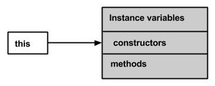

# Java Methods

A Java method is a collection of statements that are grouped together to perform an operation. When you call the System.out.println() method, for example, the system actually executes several statements in order to display a message on the console.

Now you will learn how to create your own methods with or without return values, invoke a method with or without parameters, and apply method abstraction in the program design.

Creating Method
---------------

Considering the following example to explain the syntax of a method -

Syntax
```
public static int methodName(int a, int b) {
   // body
}
```

Here,

-   public static - modifier

-   int - return type

-   methodName - name of the method

-   a, b - formal parameters

-   int a, int b - list of parameters

Method definition consists of a method header and a method body. The same is shown in the following syntax -

Syntax

```
modifier returnType nameOfMethod (Parameter List) {
   // method body
}
```

The syntax shown above includes -

-   modifier - It defines the access type of the method and it is optional to use.

-   returnType - Method may return a value.

-   nameOfMethod - This is the method name. The method signature consists of the method name and the parameter list.

-   Parameter List - The list of parameters, it is the type, order, and number of parameters of a method. These are optional, method may contain zero parameters.

-   method body - The method body defines what the method does with the statements.

**Example**

Here is the source code of the above defined method called min(). This method takes two parameters num1 and num2 and returns the maximum between the two -

```
/** the snippet returns the minimum between two numbers */

public static int minFunction(int n1, int n2) {
   int min;
   if (n1 > n2)
      min = n2;
   else
      min = n1;

   return min;
}
```

Method Calling
--------------

For using a method, it should be called. There are two ways in which a method is called i.e., method returns a value or returning nothing (no return value).

The process of method calling is simple. When a program invokes a method, the program control gets transferred to the called method. This called method then returns control to the caller in two conditions, when -

-   the return statement is executed.

-   it reaches the method ending closing brace.

The methods returning void is considered as call to a statement. Lets consider an example -
```
System.out.println("This is tutorialspoint.com!");
```
The method returning value can be understood by the following example -
```
int result = sum(6,  9);
```
Following is the example to demonstrate how to define a method and how to call it -

**Example**

```
public class ExampleMinNumber {

   public static void main(String[] args) {
      int a = 11;
      int b = 6;
      int c = minFunction(a, b);
      System.out.println("Minimum Value = " + c);
   }

   /** returns the minimum of two numbers */
   public static int minFunction(int n1, int n2) {
      int min;
      if (n1 > n2)
         min = n2;
      else
         min = n1;

      return min;
   }
}
```

This will produce the following result -
```
Minimum value = 6
```
The void Keyword
----------------

The `void` keyword allows us to create methods which do not return a value. Here, in the following example we're considering a void method *methodRankPoints*. This method is a void method, which does not return any value. Call to a void method must be a statement i.e. *methodRankPoints(255.7);*. It is a Java statement which ends with a semicolon as shown in the following example.

Example

```
public class ExampleVoid {

   public static void main(String[] args) {
      methodRankPoints(255.7);
   }

   public static void methodRankPoints(double points) {
      if (points >= 202.5) {
         System.out.println("Rank:A1");
      }else if (points >= 122.4) {
         System.out.println("Rank:A2");
      }else {
         System.out.println("Rank:A3");
      }
   }
}
```

This will produce the following result -
```
Rank:A1
```

Passing Parameters by Value
---------------------------

While working under calling process, arguments is to be passed. These should be in the same order as their respective parameters in the method specification. Parameters can be passed by value or by reference.

Passing Parameters by Value means calling a method with a parameter. Through this, the argument value is passed to the parameter.

**Example**

The following program shows an example of passing parameter by value. The values of the arguments remains the same even after the method invocation.

```
public class swappingExample {

   public static void main(String[] args) {
      int a = 30;
      int b = 45;
      System.out.println("Before swapping, a = " + a + " and b = " + b);

      // Invoke the swap method
      swapFunction(a, b);
      System.out.println("\n**Now, Before and After swapping values will be same here**:");
      System.out.println("After swapping, a = " + a + " and b is " + b);
   }

   public static void swapFunction(int a, int b) {
      System.out.println("Before swapping(Inside), a = " + a + " b = " + b);

      // Swap n1 with n2
      int c = a;
      a = b;
      b = c;
      System.out.println("After swapping(Inside), a = " + a + " b = " + b);
   }
}
```

This will produce the following result -
```
Before swapping, a = 30 and b = 45
Before swapping(Inside), a = 30 b = 45
After swapping(Inside), a = 45 b = 30

**Now, Before and After swapping values will be same here**:
After swapping, a = 30 and b is 45
```

Method Overloading
------------------

When a class has two or more methods by the same name but different parameters, it is known as method overloading. It is different from overriding. In overriding, a method has the same method name, type, number of parameters, etc.

Let's consider the example discussed earlier for finding minimum numbers of integer type. If, let's say we want to find the minimum number of double type. Then the concept of overloading will be introduced to create two or more methods with the same name but different parameters.

The following example explains the same -

**Example**

```
public class ExampleOverloading {

   public static void main(String[] args) {
      int a = 11;
      int b = 6;
      double c = 7.3;
      double d = 9.4;
      int result1 = minFunction(a, b);

      // same function name with different parameters
      double result2 = minFunction(c, d);
      System.out.println("Minimum Value = " + result1);
      System.out.println("Minimum Value = " + result2);
   }

   // for integer
   public static int minFunction(int n1, int n2) {
      int min;
      if (n1 > n2)
         min = n2;
      else
         min = n1;

      return min;
   }

   // for double
   public static double minFunction(double n1, double n2) {
     double min;
      if (n1 > n2)
         min = n2;
      else
         min = n1;

      return min;
   }
}
```

This will produce the following result -

Output

```
Minimum Value = 6
Minimum Value = 7.3
```

Overloading methods makes program readable. Here, two methods are given by the same name but with different parameters. The minimum number from integer and double types is the result.

Using Command-Line Arguments
----------------------------

Sometimes you will want to pass some information into a program when you run it. This is accomplished by passing command-line arguments to main( ).

A command-line argument is the information that directly follows the program's name on the command line when it is executed. To access the command-line arguments inside a Java program is quite easy. They are stored as strings in the String array passed to main( ).

**Example**

The following program displays all of the command-line arguments that it is called with -

```
public class CommandLine {

   public static void main(String args[]) {
      for(int i = 0; i<args.length; i++) {
         System.out.println("args[" + i + "]: " +  args[i]);
      }
   }
}
```
Try executing this program as shown here -
```
$java CommandLine this is a command line 200 -100
```
This will produce the following result -

```
args[0]: this
args[1]: is
args[2]: a
args[3]: command
args[4]: line
args[5]: 200
args[6]: -100
```

The this keyword
----------------

`this` is a keyword in Java which is used as a reference to the object of the current class, with in an instance method or a constructor. Using **this** you can refer the members of a class such as constructors, variables and methods.

Note - The keyword *this* is used only within instance methods or constructors



In general, the keyword *this* is used to -

-   Differentiate the instance variables from local variables if they have same names, within a constructor or a method.

```
class Student {
   int age;   
   Student(int age) {
      this.age = age;
   }
}
```

-   Call one type of constructor (parametrized constructor or default) from other in a class. It is known as explicit constructor invocation.

```
class Student {
   int age
   Student() {
      this(20);
   }

   Student(int age) {
      this.age = age;
   }
}
```

**Example**

Here is an example that uses *this* keyword to access the members of a class. Copy and paste the following program in a file with the name, This_Example.java.

```
public class This_Example {
   // Instance variable num
   int num = 10;

   This_Example() {
      System.out.println("This is an example program on keyword this");
   }

   This_Example(int num) {
      // Invoking the default constructor
      this();

      // Assigning the local variable num to the instance variable num
      this.num = num;	   
   }

   public void greet() {
      System.out.println("Hi Welcome to Tutorialspoint");
   }

   public void print() {
      // Local variable num
      int num = 20;

      // Printing the local variable
      System.out.println("value of local variable num is : "+num);

      // Printing the instance variable
      System.out.println("value of instance variable num is : "+this.num);

      // Invoking the greet method of a class
      this.greet();     
   }

   public static void main(String[] args) {
      // Instantiating the class
      This_Example obj1 = new This_Example();

      // Invoking the print method
      obj1.print();

      // Passing a new value to the num variable through parametrized constructor
      This_Example obj2 = new This_Example(30);

      // Invoking the print method again
      obj2.print();
   }
}
```

This will produce the following result -

```
This is an example program on keyword this
value of local variable num is : 20
value of instance variable num is : 10
Hi Welcome to Tutorialspoint
This is an example program on keyword this
value of local variable num is : 20
value of instance variable num is : 30
Hi Welcome to Tutorialspoint
```

Variable Arguments(var-args)
----------------------------

JDK 1.5 enables you to pass a variable number of arguments of the same type to a method. The parameter in the method is declared as follows -
```
typeName... parameterName
```

In the method declaration, you specify the type followed by an ellipsis (...). Only one variable-length parameter may be specified in a method, and this parameter must be the last parameter. Any regular parameters must precede it.

**Example**

```
public class VarargsDemo {

   public static void main(String args[]) {
      // Call method with variable args  
	   printMax(34, 3, 3, 2, 56.5);
      printMax(new double[]{1, 2, 3});
   }

   public static void printMax( double... numbers) {
      if (numbers.length == 0) {
         System.out.println("No argument passed");
         return;
      }

      double result = numbers[0];

      for (int i = 1; i <  numbers.length; i++)
      if (numbers[i] >  result)
      result = numbers[i];
      System.out.println("The max value is " + result);
   }
}
```

This will produce the following result -

```
The max value is 56.5
The max value is 3.0
```

The finalize( ) Method
----------------------

It is possible to define a method that will be called just before an object's final destruction by the garbage collector. This method is called finalize( ), and it can be used to ensure that an object terminates cleanly.

For example, you might use finalize( ) to make sure that an open file owned by that object is closed.

To add a finalizer to a class, you simply define the finalize( ) method. The Java runtime calls that method whenever it is about to recycle an object of that class.

Inside the finalize( ) method, you will specify those actions that must be performed before an object is destroyed.

The finalize( ) method has this general form -

```
protected void finalize( ) {
   // finalization code here
}
```

Here, the keyword protected is a specifier that prevents access to finalize( ) by code defined outside its class.

This means that you cannot know when or even if finalize( ) will be executed. For example, if your program ends before garbage collection occurs, finalize( ) will not execute.

# References
https://www.tutorialspoint.com/java/java_methods.htm
