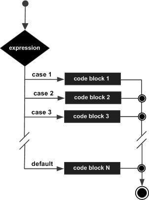

# Javascript Decision Making

While writing a program, there may be a situation when you need to adopt one out of a given set of paths. In such cases, you need to use conditional statements that allow your program to make correct decisions and perform right actions.

JavaScript supports conditional statements which are used to perform different actions based on different conditions. Here we will explain the if..else statement.

Flow Chart of if-else
The following flow chart shows how the if-else statement works.

## Decision Making
JavaScript supports the following forms of if..else statement −
```
if statement

if...else statement

if...else if... statement.
```

## if statement
The if statement is the fundamental control statement that allows JavaScript to make decisions and execute statements conditionally.

**Syntax**

The syntax for a basic if statement is as follows −
```
if (expression) {
   Statement(s) to be executed if expression is true
}
```
Here a JavaScript expression is evaluated. If the resulting value is true, the given statement(s) are executed. If the expression is false, then no statement would be not executed. Most of the times, you will use comparison operators while making decisions.

**Example**

```
<html>
   <body>     
      <script type = "text/javascript">
         <!--
            var age = 20;

            if( age > 18 ) {
               document.write("<b>Qualifies for driving</b>");
            }
         //-->
      </script>      
      <p>Set the variable to different value and then try...</p>
   </body>
</html>
```

## if...else statement
The 'if...else' statement is the next form of control statement that allows JavaScript to execute statements in a more controlled way.

**Syntax**
```
if (expression) {
   Statement(s) to be executed if expression is true
} else {
   Statement(s) to be executed if expression is false
}
```
Here JavaScript expression is evaluated. If the resulting value is true, the given statement(s) in the ‘if’ block, are executed. If the expression is false, then the given statement(s) in the else block are executed.

***Example***
```
<html>
   <body>   
      <script type = "text/javascript">
         <!--
            var age = 15;

            if( age > 18 ) {
               document.write("<b>Qualifies for driving</b>");
            } else {
               document.write("<b>Does not qualify for driving</b>");
            }
         //-->
      </script>     
      <p>Set the variable to different value and then try...</p>
   </body>
</html>
```

## if...else if... statement
The if...else if... statement is an advanced form of if…else that allows JavaScript to make a correct decision out of several conditions.

**Syntax**

The syntax of an if-else-if statement is as follows −
```
if (expression 1) {
   Statement(s) to be executed if expression 1 is true
} else if (expression 2) {
   Statement(s) to be executed if expression 2 is true
} else if (expression 3) {
   Statement(s) to be executed if expression 3 is true
} else {
   Statement(s) to be executed if no expression is true
}
```
There is nothing special about this code. It is just a series of if statements, where each if is a part of the else clause of the previous statement. Statement(s) are executed based on the true condition, if none of the conditions is true, then the else block is executed.

**Example**

Try the following code to learn how to implement an if-else-if statement in JavaScript.

```
<html>
   <body>   
      <script type = "text/javascript">
         <!--
            var book = "maths";
            if( book == "history" ) {
               document.write("<b>History Book</b>");
            } else if( book == "maths" ) {
               document.write("<b>Maths Book</b>");
            } else if( book == "economics" ) {
               document.write("<b>Economics Book</b>");
            } else {
               document.write("<b>Unknown Book</b>");
            }
         //-->
      </script>      
      <p>Set the variable to different value and then try...</p>
   </body>
<html>
```

# Switch Case Statements

You can use multiple if...else…if statements, to perform a multiway branch. However, this is not always the best solution, especially when all of the branches depend on the value of a single variable.

Starting with JavaScript 1.2, you can use a switch statement which handles exactly this situation, and it does so more efficiently than repeated if...else if statements.

The following flow chart explains a switch-case statement works.



**Syntax**

The objective of a switch statement is to give an expression to evaluate and several different statements to execute based on the value of the expression. The interpreter checks each case against the value of the expression until a match is found. If nothing matches, a default condition will be used.
```
switch (expression) {
   case condition 1: statement(s)
   break;

   case condition 2: statement(s)
   break;
   ...

   case condition n: statement(s)
   break;

   default: statement(s)
}
```
The break statements indicate the end of a particular case. If they were omitted, the interpreter would continue executing each statement in each of the following cases.

We will explain break statement in Loop Control chapter.

**Example**

Try the following example to implement switch-case statement.
```
<html>
   <body>   
      <script type = "text/javascript">
         <!--
            var grade = 'A';
            document.write("Entering switch block<br />");
            switch (grade) {
               case 'A': document.write("Good job<br />");
               break;

               case 'B': document.write("Pretty good<br />");
               break;

               case 'C': document.write("Passed<br />");
               break;

               case 'D': document.write("Not so good<br />");
               break;

               case 'F': document.write("Failed<br />");
               break;

               default:  document.write("Unknown grade<br />")
            }
            document.write("Exiting switch block");
         //-->
      </script>      
      <p>Set the variable to different value and then try...</p>
   </body>
</html>
```

## Exiting switch block
Set the variable to different value and then try...
Break statements play a major role in switch-case statements. Try the following code that uses switch-case statement without any break statement.

```
<html>
   <body>      
      <script type = "text/javascript">
         <!--
            var grade = 'A';
            document.write("Entering switch block<br />");
            switch (grade) {
               case 'A': document.write("Good job<br />");
               case 'B': document.write("Pretty good<br />");
               case 'C': document.write("Passed<br />");
               case 'D': document.write("Not so good<br />");
               case 'F': document.write("Failed<br />");
               default: document.write("Unknown grade<br />")
            }
            document.write("Exiting switch block");
         //-->
      </script>      
      <p>Set the variable to different value and then try...</p>
   </body>
</html>
```

## The ? : Ternary Operator
The Ternary operator has the following general form −

```
Exp1 ? Exp2 : Exp3;
```
Exp1, Exp2, and Exp3 are expressions. Notice the use and placement of the colon.

The value of a ‘?’ expression is determined like this: Exp1 is evaluated. If it is true, then Exp2 is evaluated and becomes the value of the entire ‘?’ expression. If Exp1 is false, then Exp3 is evaluated and its value becomes the value of the expression.

**Example**
```
function getFee(isMember) {
  return (isMember ? '$2.00' : '$10.00');
}

console.log(getFee(true));

console.log(getFee(false));

console.log(getFee(null));
```
Output
```
$2.00
$10.00
VM328:11 $10.00
```

# References
https://www.tutorialspoint.com/javascript/javascript_ifelse.htm
https://www.tutorialspoint.com/javascript/javascript_switch_case.htm
