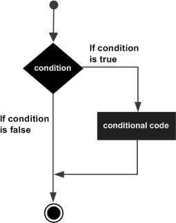
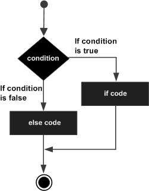

# Python Decision Making

Decision making is anticipation of conditions occurring while execution of the program and specifying actions taken according to the conditions.

Decision structures evaluate multiple expressions which produce `TRUE` or `FALSE` as outcome. You need to determine which action to take and which statements to execute if outcome is `TRUE` or `FALSE` otherwise.

Following is the general form of a typical decision making structure found in most of the programming languages −


Python programming language assumes any non-zero and non-null values as `TRUE`, and if it is either zero or null, then it is assumed as `FALSE` value.

**NOTE:** Python interprets zero (0) as `FALSE` for some conditional statements.

Python programming language provides following types of decision making statements:

## if statements
The if statement contains a logical expression using which data is compared and a decision is made based on the result of the comparison.

Syntax

```
if expression:
   statement(s)
```

If the boolean expression evaluates to TRUE, then the block of statement(s) inside the if statement is executed. If boolean expression evaluates to FALSE, then the first set of code after the end of the if statement(s) is executed.

### Flow Diagram


**Example**

```
#!/usr/bin/python

var1 = 100
if var1:
   print "1 - Got a true expression value"
   print var1

var2 = 0
if var2:
   print "2 - Got a true expression value"
   print var2
print "Good bye!"
```

When the above code is executed, it produces the following result −

```
1 - Got a true expression value
100
Good bye!
```

## if...else statements

An else statement can be combined with an if statement. An else statement contains the block of code that executes if the conditional expression in the if statement resolves to `0` or a `FALSE` value.

The else statement is an optional statement and there could be at most only one else statement following if.

**Syntax**

The syntax of the if...else statement is −

```
if expression:
   statement(s)
else:
   statement(s)
```


### Python if...else statement Example

```
#!/usr/bin/python

var1 = 100
if var1:
   print "1 - Got a true expression value"
   print var1
else:
   print "1 - Got a false expression value"
   print var1

var2 = 0
if var2:
   print "2 - Got a true expression value"
   print var2
else:
   print "2 - Got a false expression value"
   print var2

print "Good bye!"
```

When the above code is executed, it produces the following result −

```
1 - Got a true expression value
100
2 - Got a false expression value
0
Good bye!
```

### The elif Statement

The `elif` statement allows you to check multiple expressions for `TRUE` and execute a block of code as soon as one of the conditions evaluates to `TRUE`.

Similar to the else, the `elif` statement is optional. However, unlike else, for which there can be at most one statement, there can be an arbitrary number of `elif` statements following an `if`.

syntax

```
if expression1:
   statement(s)
elif expression2:
   statement(s)
elif expression3:
   statement(s)
else:
   statement(s)
```

Core Python does not provide switch or case statements as in other languages, but we can use if..elif...statements to simulate switch case as follows −

Example

```
#!/usr/bin/python

var = 100
if var == 200:
   print "1 - Got a true expression value"
   print var
elif var == 150:
   print "2 - Got a true expression value"
   print var
elif var == 100:
   print "3 - Got a true expression value"
   print var
else:
   print "4 - Got a false expression value"
   print var

print "Good bye!"
```

When the above code is executed, it produces the following result −

```
3 - Got a true expression value
100
Good bye!
```

## nested if statements
There may be a situation when you want to check for another condition after a condition resolves to true. In such a situation, you can use the nested if construct.

In a nested if construct, you can have an if...elif...else construct inside another if...elif...else construct.

**Syntax**

The syntax of the nested if...elif...else construct may be −

```
if expression1:
   statement(s)
   if expression2:
      statement(s)
   elif expression3:
      statement(s)
   elif expression4:
      statement(s)
   else:
      statement(s)
else:
   statement(s)
```

Example

```
#!/usr/bin/python

var = 100
if var < 200:
   print "Expression value is less than 200"
   if var == 150:
      print "Which is 150"
   elif var == 100:
      print "Which is 100"
   elif var == 50:
      print "Which is 50"
   elif var < 50:
      print "Expression value is less than 50"
else:
   print "Could not find true expression"

print "Good bye!"
```

When the above code is executed, it produces following result −

```
Expression value is less than 200
Which is 100
Good bye!
```

## The ? : Ternary Operator
Ternary operators are more commonly known as conditional expressions in Python. These operators evaluate something based on a condition being true or not. They became a part of Python in version 2.4. It has the following general form −

```
value_if_true if condition else value_if_false
```

Exp1, Exp2, and Exp3 are expressions. Notice the use and placement of the colon.

The value of a ‘?’ expression is determined like this: Exp1 is evaluated. If it is true, then Exp2 is evaluated and becomes the value of the entire ‘?’ expression. If Exp1 is false, then Exp3 is evaluated and its value becomes the value of the expression.

**Example**

```
is_nice = True
state = "nice" if is_nice else "not nice"
```

## Single Statement Suites
If the suite of an if clause consists only of a single line, it may go on the same line as the header statement.

Here is an example of a one-line if clause −

```
#!/usr/bin/python

var = 100
if ( var == 100 ) : print "Value of expression is 100"
print "Good bye!"
```

When the above code is executed, it produces the following result −

```
Value of expression is 100
Good bye!
```

## References
https://www.tutorialspoint.com/python/python_decision_making.htm
