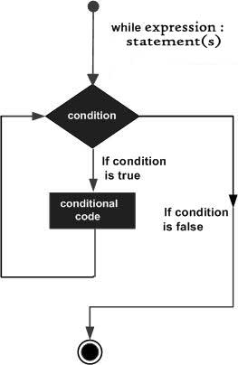
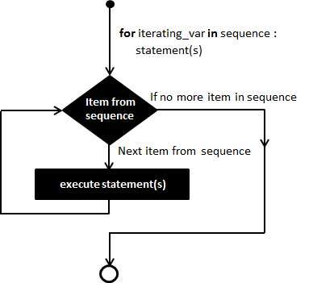

# Python Loops

In general, statements are executed sequentially: The first statement in a function is executed first, followed by the second, and so on. There may be a situation when you need to execute a block of code several number of times.

Programming languages provide various control structures that allow for more complicated execution paths.

A loop statement allows us to execute a statement or group of statements multiple times. The following diagram illustrates a loop statement −

Python programming language provides following types of loops to handle looping requirements.

## While Loops
Repeats a statement or group of statements while a given condition is TRUE. It tests the condition before executing the loop body.

A while loop statement in Python programming language repeatedly executes a target statement as long as a given condition is true.

### Syntax

The syntax of a while loop in Python programming language is -

```
while expression:
   statement(s)
```

Here, statement(s) may be a single statement or a block of statements. The condition may be any expression, and true is any non-zero value. The loop iterates while the condition is true.

When the condition becomes false, program control passes to the line immediately following the loop.

In Python, all the statements indented by the same number of character spaces after a programming construct are considered to be part of a single block of code. Python uses indentation as its method of grouping statements.

### Flow Diagram



Here, key point of the while loop is that the loop might not ever run. When the condition is tested and the result is false, the loop body will be skipped and the first statement after the while loop will be executed.

### Example

```
#!/usr/bin/python

count =  0 

while  (count <  9):
  print  'The count is:', count
  count = count +  1

print  "Good bye!"

```

When the above code is executed, it produces the following result -

```
The count is: 0
The count is: 1
The count is: 2
The count is: 3
The count is: 4
The count is: 5
The count is: 6
The count is: 7
The count is: 8
Good bye!
```

The block here, consisting of the print and increment statements, is executed repeatedly until count is no longer less than 9. With each iteration, the current value of the index count is displayed and then increased by 1.

### The Infinite Loop

A loop becomes infinite loop if a condition never becomes FALSE. You must use caution when using while loops because of the possibility that this condition never resolves to a FALSE value. This results in a loop that never ends. Such a loop is called an infinite loop.

An infinite loop might be useful in client/server programming where the server needs to run continuously so that client programs can communicate with it as and when required.

```
#!/usr/bin/python

var  =  1
while  var  ==  1:  # This constructs an infinite loop
  num = raw_input("Enter a number  :")  
  print  "You entered: ", num print  "Good bye!"
```

When the above code is executed, it produces the following result -

```
Enter a number  :20
You entered:  20
Enter a number  :29
You entered:  29
Enter a number  :3
You entered:  3
Enter a number between :Traceback (most recent call last):
   File "test.py", line 5, in <module>
      num = raw_input("Enter a number :")
KeyboardInterrupt
```

Above example goes in an infinite loop and you need to use CTRL+C to exit the program.

### Using else Statement with While Loop

Python supports to have an else statement associated with a loop statement.

-   If the else statement is used with a while loop, the else statement is executed when the condition becomes false.

The following example illustrates the combination of an else statement with a while statement that prints a number as long as it is less than 5, otherwise else statement gets executed.

```
#!/usr/bin/python
count =  0
while count <  5:
  print count,  " is  less than 5"
  count = count +  1
else:
  print count,  " is not less than 5"
```

When the above code is executed, it produces the following result -

```
0 is less than 5
1 is less than 5
2 is less than 5
3 is less than 5
4 is less than 5
5 is not less than 5
```

### Single Statement Suites

at thatSimilar to the if statement syntax, if your while clause consists only of a single statement, it may be placed on the same line as the while header.

Here is the syntax and example of a one-line while clause -

```
#!/usr/bin/python

flag = 1
while (flag): print 'Given flag is really true!'
print "Good bye!"
```

It is better not try above example because it goes into infinite loop and you need to press CTRL+C keys to exit.

## For Loops

Executes a sequence of statements multiple times and abbreviates the code that manages the loop variable.

It has the ability to iterate over the items of any sequence, such as a list or a string.

### Syntax

```
for iterating_var in sequence:
   statements(s)
```

If a sequence contains an expression list, it is evaluated first. Then, the first item in the sequence is assigned to the iterating variable *iterating_var*. Next, the statements block is executed. Each item in the list is assigned to *iterating_var*, and the statement(s) block is executed until the entire sequence is exhausted.



### Example

```
#!/usr/bin/python

for letter in 'Python':     # First Example
   print 'Current Letter :', letter

fruits = ['banana', 'apple',  'mango']
for fruit in fruits:        # Second Example
   print 'Current fruit :', fruit

print "Good bye!"
```

When the above code is executed, it produces the following result -
```

Current Letter : P
Current Letter : y
Current Letter : t
Current Letter : h
Current Letter : o
Current Letter : n
Current fruit : banana
Current fruit : apple
Current fruit : mango
Good bye!
```

### Iterating by Sequence Index

An alternative way of iterating through each item is by index offset into the sequence itself. Following is a simple example -

```
#!/usr/bin/python

fruits = ['banana', 'apple',  'mango']
for index in range(len(fruits)):
   print 'Current fruit :', fruits[index]

print "Good bye!"
```

When the above code is executed, it produces the following result -

```
Current fruit : banana
Current fruit : apple
Current fruit : mango
Good bye!
```

Here, we took the assistance of the `len()` built-in function, which provides the total number of elements in the tuple as well as the range() built-in function to give us the actual sequence to iterate over.

### Using else Statement with For Loop

Python supports to have an else statement associated with a loop statement

-   If the else statement is used with a for loop, the else statement is executed when the loop has exhausted iterating the list.

The following example illustrates the combination of an else statement with a for statement that searches for prime numbers from 10 through 20.

```
#!/usr/bin/python

for num in range(10,20):     #to iterate between 10 to 20
   for i in range(2,num):    #to iterate on the factors of the number
      if num%i == 0:         #to determine the first factor
         j=num/i             #to calculate the second factor
         print '%d equals %d * %d' % (num,i,j)
         break #to move to the next number, the #first FOR
   else:                  # else part of the loop
      print num, 'is a prime number'
		break
```

When the above code is executed, it produces the following result -

```
10 equals 2 * 5
11 is a prime number
12 equals 2 * 6
13 is a prime number
14 equals 2 * 7
15 equals 3 * 5
16 equals 2 * 8
17 is a prime number
18 equals 2 * 9
19 is a prime number
```

## Nested Loops

You can use one or more loop inside any another while, for or do..while loop.

Python programming language allows to use one loop inside another loop. Following section shows few examples to illustrate the concept.

### Syntax

```
for iterating_var in sequence:
   for iterating_var in sequence:
      statements(s)
   statements(s)
```

The syntax for a nested while loop statement in Python programming language is as follows −

```
while expression:
   while expression:
      statement(s)
   statement(s)
```

A final note on loop nesting is that you can put any type of loop inside of any other type of loop. For example a for loop can be inside a while loop or vice versa.

### Example
The following program uses a nested for loop to find the prime numbers from 2 to 100 −

```
#!/usr/bin/python

i = 2
while(i < 100):
   j = 2
   while(j <= (i/j)):
      if not(i%j): break
      j = j + 1
   if (j > i/j) : print i, " is prime"
   i = i + 1

print "Good bye!"
```

When the above code is executed, it produces following 
result −


```
2 is prime
3 is prime
5 is prime
7 is prime
11 is prime
13 is prime
17 is prime
19 is prime
23 is prime
29 is prime
31 is prime
37 is prime
41 is prime
43 is prime
47 is prime
53 is prime
59 is prime
61 is prime
67 is prime
71 is prime
73 is prime
79 is prime
83 is prime
89 is prime
97 is prime
Good bye!
```
## Loop Control Statements
Loop control statements change execution from its normal sequence. When execution leaves a scope, all automatic objects that were created in that scope are destroyed.

Python supports the following control statements. Click the following links to check their detail.

Let us go through the loop control statements briefly

### Break Statement

Terminates the loop statement and transfers execution to the statement immediately following the loop.

It terminates the current loop and resumes execution at the next statement, just like the traditional break statement in C.

The most common use for break is when some external condition is triggered requiring a hasty exit from a loop. The break statement can be used in both while and for loops.

If you are using nested loops, the break statement stops the execution of the innermost loop and start executing the next line of code after the block.

#### Syntax
The syntax for a break statement in Python is as follows −

```
break
```

#### Example

```
#!/usr/bin/python

for letter in 'Python':     # First Example
   if letter == 'h':
      break
   print 'Current Letter :', letter

var = 10                    # Second Example
while var > 0:              
   print 'Current variable value :', var
   var = var -1
   if var == 5:
      break

print "Good bye!"
```

When the above code is executed, it produces the following result −

```
Current Letter : P
Current Letter : y
Current Letter : t
Current variable value : 10
Current variable value : 9
Current variable value : 8
Current variable value : 7
Current variable value : 6
Good bye!
```

### Continue Statement
Causes the loop to skip the remainder of its body and immediately retest its condition prior to reiterating.

It returns the control to the beginning of the while loop.. The continue statement rejects all the remaining statements in the current iteration of the loop and moves the control back to the top of the loop.

The continue statement can be used in both while and for loops.

#### Syntax
```
continue
```

#### Example

```
#!/usr/bin/python

for letter in 'Python':     # First Example
   if letter == 'h':
      continue
   print 'Current Letter :', letter

var = 10                    # Second Example
while var > 0:              
   var = var -1
   if var == 5:
      continue
   print 'Current variable value :', var
print "Good bye!"
```

When the above code is executed, it produces the following result −

```
Current Letter : P
Current Letter : y
Current Letter : t
Current Letter : o
Current Letter : n
Current variable value : 9
Current variable value : 8
Current variable value : 7
Current variable value : 6
Current variable value : 4
Current variable value : 3
Current variable value : 2
Current variable value : 1
Current variable value : 0
Good bye!
```

### Pass Statement
The pass statement in Python is used when a statement is required syntactically but you do not want any command or code to execute.

It is used when a statement is required syntactically but you do not want any command or code to execute.

The pass statement is a null operation; nothing happens when it executes. The pass is also useful in places where your code will eventually go, but has not been written yet (e.g., in stubs for example) −

#### Syntax
```
pass
```

#### Example

```
#!/usr/bin/python

for letter in 'Python':
   if letter == 'h':
      pass
      print 'This is pass block'
   print 'Current Letter :', letter

print "Good bye!"
```

When the above code is executed, it produces following result −

```
Current Letter : P
Current Letter : y
Current Letter : t
This is pass block
Current Letter : h
Current Letter : o
Current Letter : n
Good bye!
```

## References
https://www.tutorialspoint.com/python/python_loops.htm
