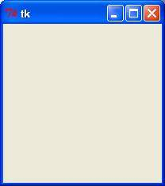

Python GUI Programming (Tkinter)

Python provides various options for developing graphical user interfaces (GUIs). Most important are listed below.

-   Tkinter - Tkinter is the Python interface to the Tk GUI toolkit shipped with Python. We would look this option in this chapter.

-   wxPython - This is an open-source Python interface for wxWindows [http://wxpython.org](http://wxpython.org/).

-   JPython - JPython is a Python port for Java which gives Python scripts seamless access to Java class libraries on the local machine [http://www.jython.org](http://www.jython.org/).

There are many other interfaces available, which you can find them on the net.

Tkinter Programming
-------------------

Tkinter is the standard GUI library for Python. Python when combined with Tkinter provides a fast and easy way to create GUI applications. Tkinter provides a powerful object-oriented interface to the Tk GUI toolkit.

Creating a GUI application using Tkinter is an easy task. All you need to do is perform the following steps -

-   Import the *Tkinter* module.

-   Create the GUI application main window.

-   Add one or more of the above-mentioned widgets to the GUI application.

-   Enter the main event loop to take action against each event triggered by the user.

Example
-------
```
#!/usr/bin/python

import Tkinter
top = Tkinter.Tk()
# Code to add widgets will go here...
top.mainloop()
```
This would create a following window -



Tkinter Widgets
---------------
TODO: Add Tkinter Widgets documentation

# References
https://www.tutorialspoint.com/python/python_gui_programming.htm
