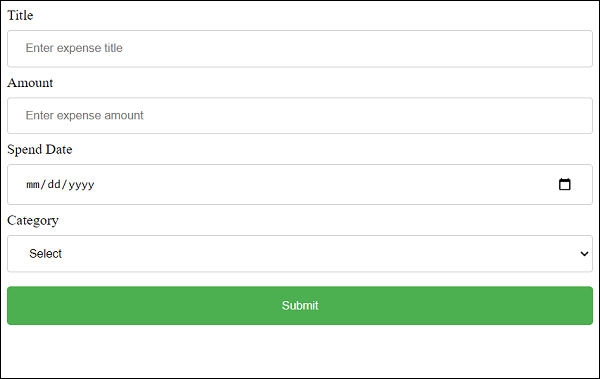

# ReactJS Formss

The nature of form programming needs the state to be maintained. Because, the input field information will get changed as the user interacts with the form. But as we learned earlier, React library does not store or maintain any state information by itself and component has to use state management api to manage state. Considering this, React provides two types of components to support form programming.

Controlled component − In controlled component, React provides a special attribute, value for all input elements and controls the input elements. The value attribute can be used to get and set the value of the input element. It has to be in sync with state of the component.

Uncontrolled component − In uncontrolled component, React provides minimal support for form programming. It has to use Ref concept (another react concept to get a DOM element in the React component during runtime) to do the form programming.

Let us learn the form programming using controlled as well as uncontrolled component in this chapter.

## Controlled component

Controlled component has to follow a specific process to do form programming. Let us check the step by step process to be followed for a single input element.

Create a form element.
```
<input type="text" name="username" />
```
Create a state for input element.
```
this.state = {
   username: ''
}
```
Add a value attribute and assign the value from state.
```
<input type="text" name="username" value={this.state.username} />
```
Add a onChange attribute and assign a handler method.
```
<input type="text" name="username" value={this.state.username} onChange={this.handleUsernameChange} />
```
Write the handler method and update the state whenever the event is fired.
```
handleUsernameChange(e) {
   this.setState({
      username = e.target.value
   });
}
```
Bind the event handler in the constructor of the component.
```
this.handleUsernameChange = this.handleUsernameChange.bind(this)
```
Finally, get the input value using username from this.state during validation and submission.
```
handleSubmit(e) {
   e.preventDefault();
   alert(this.state.username);
}
```
Let us create a simple form to add expense entry using controller component in this chapter.

First, create a new react application, react-form-app using Create React App or Rollup bundler by following instruction in Creating a React application chapter.

Next, open the application in your favorite editor.

In the next step, create src folder under the root directory of the application.

Further to the above process, create components folder under src folder.

Next, create a file, ExpenseForm.css under src folder to style the component.
```
input[type=text], input[type=number], input[type=date], select {
   width: 100%;
   padding: 12px 20px;
   margin: 8px 0;
   display: inline-block;
   border: 1px solid #ccc;
   border-radius: 4px;
   box-sizing: border-box;
}
input[type=submit] {
   width: 100%;
   background-color: #4CAF50;
   color: white;
   padding: 14px 20px;
   margin: 8px 0;
   border: none;
   border-radius: 4px;
   cursor: pointer;
}
input[type=submit]:hover {
   background-color: #45a049;
}
input:focus {
   border: 1px solid #d9d5e0;
}
#expenseForm div {
   border-radius: 5px;
   background-color: #f2f2f2;
   padding: 20px;
}
```
Next, create a file, ExpenseForm.js under src/components folder and start editing.

Next, import React library.
```
import React from 'react';
```
Next, import ExpenseForm.css file.
```
import './ExpenseForm.css'
```
Next, create a class, ExpenseForm and call constructor with props.
```
class ExpenseForm extends React.Component {
   constructor(props) {
      super(props);
   }
}
```
Next, initialize the state of the component.
```
this.state = {
   item: {}
}
```
Next, create render() method and add a form with input fields to add expense items.
```
render() {
   return (
      <div id="expenseForm">
         <form>
            <label for="name">Title</label>
            <input type="text" id="name" name="name" placeholder="Enter expense title" />
            <label for="amount">Amount</label>
            <input type="number" id="amount" name="amount" placeholder="Enter expense amount" />
            <label for="date">Spend Date</label>
            <input type="date" id="date" name="date" placeholder="Enter date" />
            <label for="category">Category</label>
            <select id="category" name="category"
              <option value="">Select</option>
              <option value="Food">Food</option>
              <option value="Entertainment">Entertainment</option>
              <option value="Academic">Academic</option>
            </select>
            <input type="submit" value="Submit" />
         </form>
      </div>
   )
}
```
Next, create event handler for all the input fields to update the expense detail in the state.
```
handleNameChange(e) {
   this.setState( (state, props) => {
      let item = state.item
      item.name = e.target.value;
      return { item: item }
   });
}
handleAmountChange(e) {
   this.setState( (state, props) => {
      let item = state.item
      item.amount = e.target.value;
      return { item: item }
   });
}
handleDateChange(e) {
   this.setState( (state, props) => {
      let item = state.item
      item.date = e.target.value;
      return { item: item }
   });
}
handleCategoryChange(e) {
   this.setState( (state, props) => {
      let item = state.item
      item.category = e.target.value;
      return { item: item }
   });
}
```
Next, bind the event handler in the constructor.
```
this.handleNameChange = this.handleNameChange.bind(this);
this.handleAmountChange = this.handleAmountChange.bind(this);
this.handleDateChange = this.handleDateChange.bind(this);
this.handleCategoryChange = this.handleCategoryChange.bind(this);
```
Next, add an event handler for the submit action.
```
onSubmit = (e) => {
   e.preventDefault();
   alert(JSON.stringify(this.state.item));
}
```
Next, attach the event handlers to the form.
```
render() {
   return (
      <div id="expenseForm">
         <form onSubmit={(e) => this.onSubmit(e)}>
            <label for="name">Title</label>
            <input type="text" id="name" name="name" placeholder="Enter expense title"
               value={this.state.item.name}
               onChange={this.handleNameChange} />

            <label for="amount">Amount</label>
            <input type="number" id="amount" name="amount" placeholder="Enter expense amount"
               value={this.state.item.amount}
               onChange={this.handleAmountChange} />

            <label for="date">Spend Date</label>
            <input type="date" id="date" name="date" placeholder="Enter date"
               value={this.state.item.date}
               onChange={this.handleDateChange} />

            <label for="category">Category</label>
            <select id="category" name="category"
               value={this.state.item.category}
               onChange={this.handleCategoryChange} >
              <option value="">Select</option>
              <option value="Food">Food</option>
              <option value="Entertainment">Entertainment</option>
              <option value="Academic">Academic</option>
            </select>

            <input type="submit" value="Submit" />
         </form>
      </div>
   )
}
```
Finally, export the component.
```
export default ExpenseForm
```
The complete code of the ExpenseForm component is as follows −
```
import React from 'react';
import './ExpenseForm.css'

class ExpenseForm extends React.Component {
   constructor(props) {
      super(props);
      this.state = {
         item: {}
      }
      this.handleNameChange = this.handleNameChange.bind(this);
      this.handleAmountChange = this.handleAmountChange.bind(this);
      this.handleDateChange = this.handleDateChange.bind(this);
      this.handleCategoryChange = this.handleCategoryChange.bind(this);
   }
   handleNameChange(e) {
      this.setState( (state, props) => {
         let item = state.item
         item.name = e.target.value;
         return { item: item }
      });
   }
   handleAmountChange(e) {
      this.setState( (state, props) => {
         let item = state.item
         item.amount = e.target.value;
         return { item: item }
      });
   }
   handleDateChange(e) {
      this.setState( (state, props) => {
         let item = state.item
         item.date = e.target.value;
         return { item: item }
      });
   }
   handleCategoryChange(e) {
      this.setState( (state, props) => {
         let item = state.item
         item.category = e.target.value;
         return { item: item }
      });
   }
   onSubmit = (e) => {
      e.preventDefault();
      alert(JSON.stringify(this.state.item));
   }
   render() {
      return (
         <div id="expenseForm">
           <form onSubmit={(e) => this.onSubmit(e)}>
            <label for="name">Title</label>
            <input type="text" id="name" name="name" placeholder="Enter expense title"
               value={this.state.item.name}
               onChange={this.handleNameChange} />

            <label for="amount">Amount</label>
            <input type="number" id="amount" name="amount" placeholder="Enter expense amount"
               value={this.state.item.amount}
               onChange={this.handleAmountChange} />

            <label for="date">Spend Date</label>
            <input type="date" id="date" name="date" placeholder="Enter date"
               value={this.state.item.date}
               onChange={this.handleDateChange} />

            <label for="category">Category</label>
            <select id="category" name="category"
               value={this.state.item.category}
               onChange={this.handleCategoryChange} >
              <option value="">Select</option>
              <option value="Food">Food</option>
              <option value="Entertainment">Entertainment</option>
              <option value="Academic">Academic</option>
            </select>

            <input type="submit" value="Submit" />
           </form>
         </div>
      )
   }
}
export default ExpenseForm;
```
Next, create a file, index.js under the src folder and use ExpenseForm component.
```
import React from 'react';
import ReactDOM from 'react-dom';
import ExpenseForm from './components/ExpenseForm'

ReactDOM.render(
   <React.StrictMode>
      <ExpenseForm />
   </React.StrictMode>,
   document.getElementById('root')
);
```
Finally, create a public folder under the root folder and create index.html file.
```
<!DOCTYPE html>
<html lang="en">
   <head>
      <meta charset="utf-8">
      <title>React App</title>
   </head>
   <body>
      <div id="root"></div>
      <script type="text/JavaScript" src="./index.js"></script>
   </body>
</html>
```
Next, serve the application using npm command.
```
npm start
```
Next, open the browser and enter http://localhost:3000 in the address bar and press enter.



Uncontrolled Component

Formik

# References
https://www.tutorialspoint.com/reactjs/reactjs_form.htm
