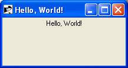

# Ruby GUI Programming (Tk)

The standard graphical user interface (GUI) for Ruby is Tk. Tk started out as the GUI for the Tcl scripting language developed by John Ousterhout.

Tk has the unique distinction of being the only cross-platform GUI. Tk runs on Windows, Mac, and Linux and provides a native look-and-feel on each operating system.

The basic component of a Tk-based application is called a widget. A component is also sometimes called a window, since, in Tk, "window" and "widget" are often used interchangeably.

Tk applications follow a widget hierarchy where any number of widgets may be placed within another widget, and those widgets within another widget, ad infinitum. The main widget in a Tk program is referred to as the root widget and can be created by making a new instance of the TkRoot class.

Most Tk-based applications follow the same cycle: create the widgets, place them in the interface, and finally, bind the events associated with each widget to a method.

There are three geometry managers; place, grid and pack that are responsible for controlling the size and location of each of the widgets in the interface.

## Installation
The Ruby Tk bindings are distributed with Ruby but Tk is a separate installation. Windows users can download a single click Tk installation from ActiveState's ActiveTcl.

Mac and Linux users may not need to install it because there is a great chance that its already installed along with OS but if not, you can download prebuilt packages or get the source from the Tcl Developer Xchange.

## Simple Tk Application
A typical structure for Ruby/Tk programs is to create the main or root window (an instance of TkRoot), add widgets to it to build up the user interface, and then start the main event loop by calling Tk.mainloop.

The traditional Hello, World! example for Ruby/Tk looks something like this −
```
require 'tk'

root = TkRoot.new { title "Hello, World!" }
TkLabel.new(root) do
   text 'Hello, World!'
   pack { padx 15 ; pady 15; side 'left' }
end
Tk.mainloop
```
Here, after loading the tk extension module, we create a root-level frame using TkRoot.new. We then make a TkLabel widget as a child of the root frame, setting several options for the label. Finally, we pack the root frame and enter the main GUI event loop.

If you would run this script, it would produce the following result −



# References
https://www.tutorialspoint.com/ruby/ruby_tk_guide.htm
