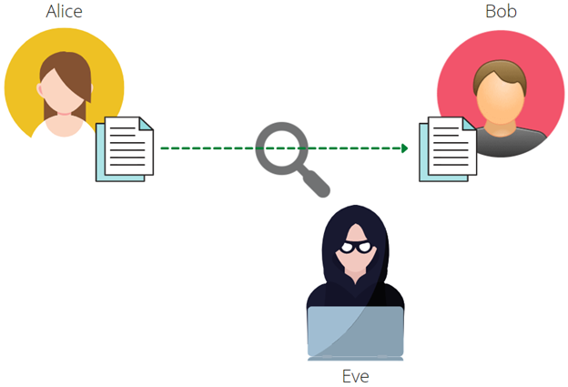
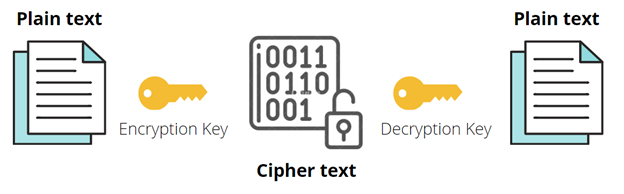
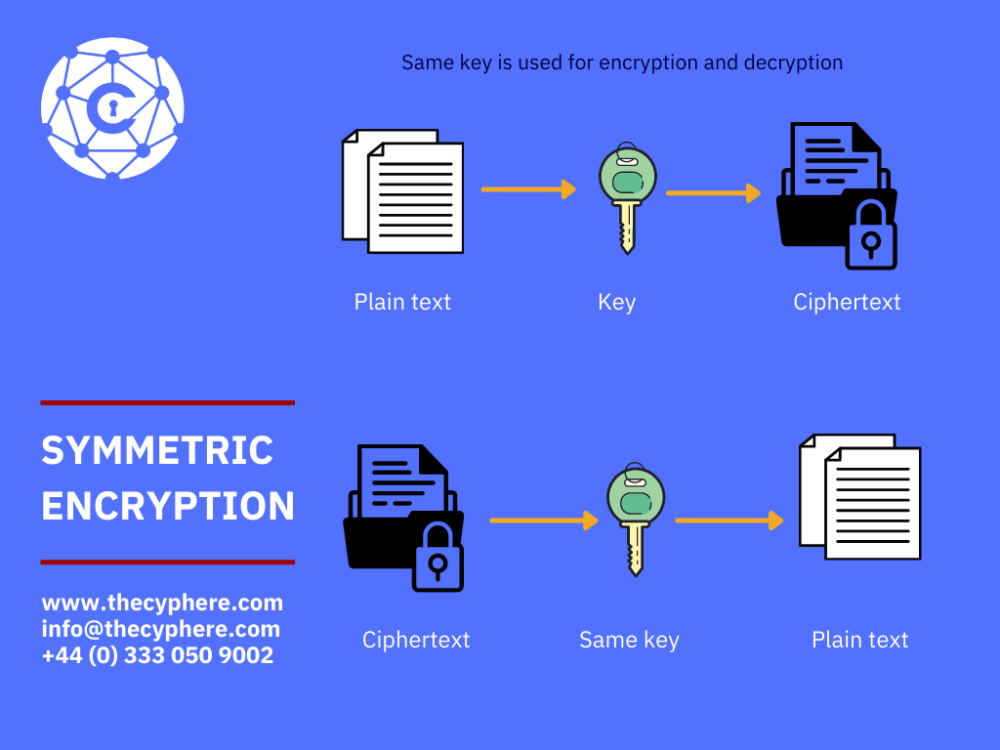
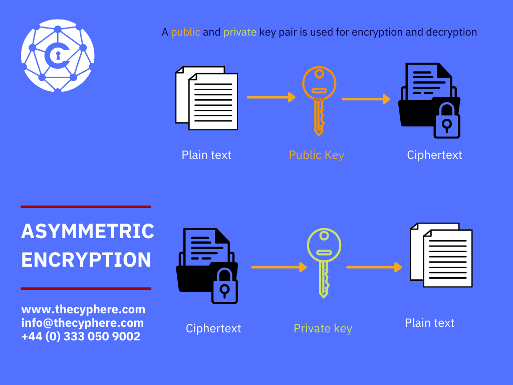

# Encryption
Encryption is the process of converting plaintext data into an alternative form known as ciphertext. From there, only authorised users can decipher the ciphertext back into clear-text to access the information.

## The Problem
To understand how encryption works, you will need to understand the problem that encrytion attempts to solve.

Alice and Bob want to send each other mes containing some sensitive information. They are concerned that if they send the information in plaintext, a malicious person, Eve, will intercept and read the sensitive information.

Encryption covers the process by which Alice and Bob can send messages to each other in a format that Eve cannot read. The encryption algorithm scrambles (encrypts) the data before the data is sent, so that Eve cannot read the original message. Then, the data is unscrambled (decrypted) once the message arrives to Alice or Bob.

## Encryption Keys
An encryption key is a random value used along with an algorithm to encrypt and decrypt data. To encrypt data, a unique key is used with an encryption algorithm. After encryption, an encryption key must be used to decrypt the data as well. There are two types of encryption in widespread use:  Symmetric and Asymmetric. These names symbolise whether the same key can be used for encryption and decryption processes.

For symetric encryption, the same key is used to encrypt and decrypt data.

For asymetric encryption, a pair of keys (public key, and private key) are used to encrypt/decrypt.

- Data encrypted with the public key can only be decrypted with the corresponding private key of the key pair.

- Data encrypted with the private key can only be decrypted with the corresponding public key of the key pair.

- Public keys can be shared with others.

- Private keys should never be shared.

If Alice sends Bob a message that she encrypts with Bob's public key (public keys can be shared). The message can only be decrypted with Bob's provate key (should never be shared). Ensuring that Bob is the only person that can decrypt & read the message.

If Alice sends data that she encrypts with her private key. Only her public key can be used to decrypt the data, thus validating that the message really came from Alice. This can also be known as "signing".

## Symmetric encryption vs asymmetric encryption
It is important to understand the differences between symmetric and asymmetric encryption processes. To start with, we will explain the basics and then advantages and disadvantages along with asymmetric and symmetric encryption example.

## What is symmetric encryption?
Symmetric encryption is the process of converting plaintext into ciphertext and vice versa using the same key. An encryption key is a random string of bits used to encrypt or decrypt data. It is, therefore, important that key is transferred between the sender and recipient using secure methods.

RC4, RC5, RC6, IDEA, Blowfish, AES, DES and 3DES are symmetric encryption algorithms.

### Advantages of symmetric encryption
One main advantage of symmetric encryption is its speed because keys are much shorter, and the overall process is quicker.

### Disadvantages of symmetric encryption
One main disadvantage of using symmetric encryption is using the same key. This key is shared between the sender and recipient. It adds to overheads such as secure storage of key and keeping it secure during transmission.

### symmetric encryption example and use case
- Data storage, for instance, data at rest such as laptop disk drives, USB that is not moving and stored in one place, is often encrypted using symmetric encryption. Full disk encryption software work on this concept where a user’s secret key is generated to encrypt disk volumes and can only be decrypted when the key is provided.

- Payment information such as credit card numbers, PII or other sensitive information in databases is encrypted using symmetric cryptography.

## What is asymmetric encryption?
Asymmetric encryption, also known as public-key cryptography, uses the concept of a key pair. The sender and the recipient use a pair of keys, i.e. a private key and a public key during the encryption and decryption process. It works like this:

- Private keys are kept secret by the senders and recipients to encrypt/decrypt messages.
- Only public keys are shared across the public at large.
- The private key and public key pairs are mathematically related to each other, but you cannot generate the private key using a public key.

Asymmetric encryption algorithms examples include RSA, Diffie-Hellman, ECC and DSA.

### Advantages of asymmetric encryption
Asymmetric encryption is considered more secure as it does not involves sharing of keys. A user never reveals or shares their private key.

### Disadvantages of asymmetric encryption
It takes more time than symmetric encryption, tends to be a slower process. However, this is not a huge drawback and is used widely to encrypt data where security is the primary concern.

### Asymmetric encryption example and use case
- Public key infrastructure (PKI) – It is everything relates to governing encryption using digital certificates and management of public-key encryption.

- Cryptocurrency is finding the primary use of asymmetric encryption through blockchains to authorize transactions and confirm identities. Public key cryptography is a major component of Bitcoin’s protocol, utilising Elliptic Curve Digital Signature Algorithm (ECDSA).

- Digital signatures help with confirming identities using asymmetric encryption.

### What is the difference between encrypting and signing in asymmetric encryption?
Encryption in public-key cryptography uses someone’s public key to encrypt a message and recipient can see the message using their private key.

Signing is related to verification to ensure it’s really the right sender who has sent the message. For instance, when signing, you use your private key to compose a message and the recipient using your public key to verify it’s indeed sent by you.

## Combining symmetric and asymmetric encryption
Many applications take advantage of the combination of symmetric and asymmetric encryption together. When both, symmetric key and asymmetric key cryptography, are combined, it most likely follows this methodology:

- The plaintext is encrypted to ciphertext utilising symmetric encryption to make use of speed.
- Asymmetric encryption is used for keys exchange used for symmetric encryption. This ensures the security of asymmetric cryptography, making sure only the intended recipient can perform decryption.

Common examples include SSL/TLS connections and messaging applications such as Signal, Whatsapp that use end-to-end encryption to prevent third-parties and application vendor from accessing calls or messages. Here, asymmetric encryption is used to establish the encrypted communication between the two users, and symmetric encryption is used for communication duration.

# References

https://thecyphere.com/blog/symmetric-and-asymmetric-encryption/
