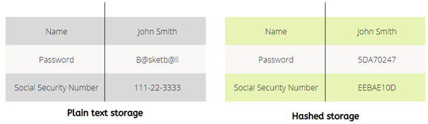

# What is hashing?
Hashing is a one-way function used to calculate a specific fix size value based on the input.

Hashing uses mathematical algorithms called a hash function that calculates a fixed-size resulting string (called a hash) from the input string supplied to it. The size of the input string can vary to any size, but the resulting hash will always be of a fixed size.

Hashing can be used to verify data integrity of a string, file, properties of a file, piece of data, etc. Hashing is quite often wrongly referred to as an encryption method.

A good hashing algorithm displays an avalanche effect; this means that even if a single bit or character of the input changed, the resultant hash would change completely. If a hash function does not exhibit this characteristic, it is said to have inadequate randomisation and can easily be exploited by attackers.

For enhanced cyber security, hashing can be used to store sensitive data, authentication mechanisms and checking data integrity (i.e. to check if data has been changed or not). For example, if a company’s databases were breached and stored data in a readable format (clear-text), the information fell into the wrong hands for further misuse. But if the data was stored in hashed formats, then the values will be useless for the attackers.

## Features of hash functions
Features of a hash function include:

Fixed length output:
- Hash functions take an arbitrary length input and always return a fixed-length hash value depending upon the algorithm.
- The length of the hashes can be relatively much smaller than the input data because these hash functions are also called compression functions.

Efficiency
- For any hash function H with input X, H(X) computation is relatively a much faster operation.

Uni-directional or One-way
- Hashes are irreversible.
- Once a hash value is generated, converting it back to the original data is not possible.

Collision Free
- A good hash function must be collision-free which means that no two input strings can produce the same hash value. Or, to put it in another way, a hash function should always have a unique output for different input strings.
- Whenever a hash function is run against an input value, it must always produce the same result every time.

## Hashing Algorhtims
There are many different algorithms used for hashing, but the most frequently used are as follows:

### MD5
- MD5 stands for Message Digest algorithm 5.

- MD5 generates 32 characters or 128-bit hexadecimal hash of any input string supplied.

- It is often used as a checksum to verify data integrity.

- MD5 does have some identified collisions. Hence it is no longer recommended to use.
md5 hashing algorithm

### SHA-2
SHA stands for Secure Hash function and was developed by the National Security Agency (NSA). Currently, out of the SHA family, SHA-2 is the most widely used algorithm.

SHA-2 consists of six hash functions that can generate 224, 256, 384 or 512 bits.  The six hash functions are:
- SHA-224
- SHA-256
- SHA-384
- SHA-512
- SHA-512/224
- SHA-512/256.

Until now, no collisions for SHA-2 have been detected.

### CRC32

CRC stands for Cyclic Redundancy Check. This is an error-detecting code. CRC is used for mainly file integrity checks and is commonly used on Zip files and FTP servers. CRC generated hexadecimal hash values of 32-bits or eight characters.

What is a collision in encryption?
Being unidirectional is one of the requirements of hashing in cybersecurity. This is necessary so that an attacker can not recreate the original data if hashes are leaked in any data breach. Simultaneously two input strings mustn’t generate an identical hash, known as a collision.

Let’s take the example of detecting a collision. The images below of a ship and a plane are clearly visually different and must generate two unique hashes.

## What is a collision in encryption?

One of the requirements for hashing is that two input strings mustn’t generate an identical hash, known as a collision.

Let’s take the example of detecting a collision. The images below of a ship and a plane are clearly visually different and must generate two unique hashes.

When using MD5 to generate the hash, it can be seen that the value of these hashes for the two different images is the same. Hence a collision exists.

However, using SHA-256 to generate the hash, it can be seen that the values are completely different; hence there is no collision.

## Digital Signatures
Hashing is also used in determining a message’s integrity for the message senders and receivers with the help of digital signatures.

Before sending the message, a hash of the signed message is generated, i.e. H1, and then the message along with hash H1  is transferred across the network. A second hash is generated again using the same algorithm on the receiver’s end, i.e. H2. Both H1 and H2 are compared; if the hashes are equal, then the message is not tampered with during transfer.

## Password Storage
Hash functions are widely used to store passwords in databases etc., securely. This can sufficiently decrease the impact and extent of an attacker if he has to access any breached database because he will not be able to revert the hashes to the original passwords.

If the breached database stores password as hashes, then these will not be of any use to an attacker. The attacker would view some value in the database like 5f4dcc3b5aa765d61d8327deb882cf99, but this is the non-reversable hash value, not the actual password. Thus the passwords will be protected.

## File equality
Hashing is also proper when there is a need to compare two or more files. Traditionally, a person would have to open both files and compare word by word if any changes are made, but any changes can be quickly identified using hashing.

## Can a hash be reversed?
As discussed earlier, hashes are only a one-way process meaning that the original data cannot be reconstructed from a hash value using mathematical algorithms. However, it is possible to crack hashes using a technique called the rainbow table attack.

For simplicity, a rainbow table is a database that contains two columns; the first column contains plaintext values, and the second column contains their hash values. Attackers use this database to find the plaintext value; it can also be called a reverse lookup.

Since hash functions generate unique values, only one plaintext string can correspond to a hash value, and that is the cracked hash.

Many websites host millions of entries of common plaintext strings along with their hash values, so attackers just have to search the hash value and see the corresponding plaintext string. Many automated tools can perform these attacks; JohnTheRipper and HashCat are some of the most famous ones.

## What is salt in cybersecurity?
Salt is a random string of data added to the original string when hash functions are being used. It is typically used to increase password protection and protect against brute force attacks. Since two or more users may use the same passwords, this will result in similar hashes being stored. Salts prevent this from happening as using the random strings generate unique hashes each time.

If an attacker has access to breached databases and he sees duplicate hashes stored, a probable reason for that will be that there is no salting being used or a weak algorithm is being used, and collisions are taking place.

## What does salting a password means?
Passwords can be stored in databases as hashed values. The benefits and risks of doing so are already discussed earlier. But by salting a password, an extra layer of security is added to the password protection. Salting a password means that the application code appends or prepends a random string to the original password and then creates a hash of this salted password.

For example, if the password is “DontHackMe”, the SHA-2 hash of this password store in the database will be: 446d2b4e925b732ae6917062bcfaf6f07223d95fb7bcdba78c341c32d85e5333.

By adding a random salt, the value that is hashed becomes “DontHackMe885eef” and the generated hash is then: a45856b0757c7cec9eda5382bcfd47bb52d2ff2125b9595cbbf8aad345ec074c.

hashing and salting

### What is the use of salting in hashing?
Salting is used in hashing to:

- Increase password protection.
- Reduce the probability of collisions.
- Increase the complexity so that attackers can not crack the hashes.
- Mitigate the risks of rainbow table attacks.

# References

https://thecyphere.com/blog/difference-hashing-encryption-salting/
