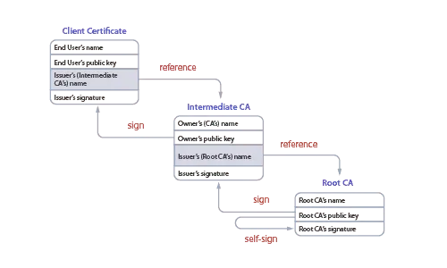
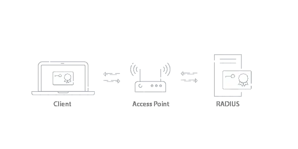
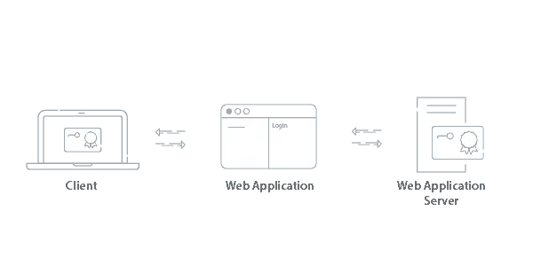
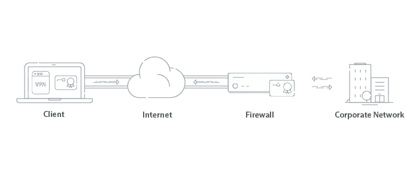
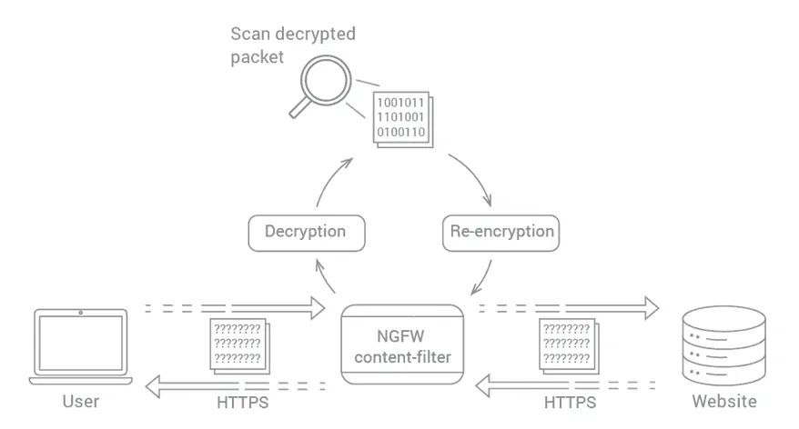
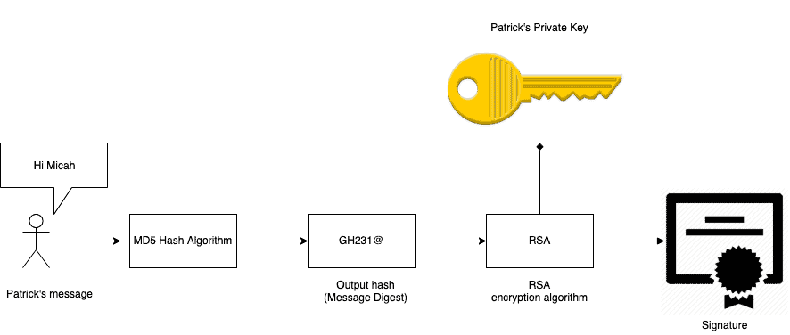

## What is PKI in Network Security?

The purpose of a Public Key Infrastructure (PKI) is to manage the public keys used by the network for public key encryption, identity management, certificate distribution, certificate revocation, and certificate management. Once enabled, users who enroll for a certificate are identified for later authentication or certificate revocation.

The PKI allows users and systems to verify the legitimacy of certificate-holding entities and securely exchange information between them over the air. The introduction of a PKI enables stronger, certificate-based security, as well as identity services and management tools to maximize network efficiency and security.

## What are the components of a PKI?

A public key system relies on asymmetric cryptography, which consists of a public and private key pair. The Certificate Authority (CA) certifies the ownership of the key pairs and completes the PKI setup.

The ultimate goal of a PKI is identity and access management for a secure network.

### PUBLIC KEY
A Public Key is a cryptographic key that can be distributed to the public and does not require secure storage. Messages encrypted by the public key can only be decrypted by the corresponding private key.

### PRIVATE KEY
Private Keys are used by the recipient to decrypt a message that is encrypted using a public key. Since the message is encrypted using a given public key, it can only be decrypted by the matching private key. This establishes the ownership of the private and public key, ensuring the message is only read by the approved parties.

### CERTIFICATE AUTHORITY (CA)
The CA generally handles all aspects of the certificate management for a PKI, including the phases of certificate lifecycle management.

A CA issues certificates to be used to confirm that the subject imprinted on the certificate is the owner of the public key. In a PKI system, the client generates a public-private key pair. The public key and information to be imprinted on the certificate are sent to the CA. The CA then creates a digital certificate consisting of the user’s public key and certificate attributes. The certificate is signed by the CA with its private key.

Once the certificate is distributed to the user, they can present the signed certificate and the receiver can trust that it belongs to the client because of the matching public-private key pair.

### ROOT CERTIFICATE AUTHORITY
A Root CA is a trusted CA that is entitled to verify the identity of a person and signs the root certificate that is distributed to a user. The certificate is considered valid because it has been verified and signed by a trusted root CA.

### INTERMEDIATE CERTIFICATE AUTHORITY
An Intermediate CA is also a trusted CA, and is used as a chain between the root CA and the client certificate that the user enrolls for. Since the root CA has signed and trusts the intermediate CA, certificates that are generated from the intermediate CA are trusted as if they were signed by the root CA. SecureW2’s PKI always uses the intermediate CA to generate client certificates for Wi-Fi authentication, as it’s a best practice. SecureW2’s intermediate CA can never be compromised, since a hardware level of encryption is used for the private key of intermediate CAs.

### CERTIFICATE REVOCATION LIST (CRL)
A CRL is a list of certificates that have been revoked by the CA that issued them before they were set to expire. This is a helpful security feature if a device is stolen that contains a certificate. A RADIUS server only rejects a connection request from a device if the device’s certificate serial number is contained in the CRL. The Certificate Authority is the one that maintains this list, and the RADIUS server periodically downloads this list by sending a query to the CA. There are two types of CRLs: A Delta CRL and a Base CRL.

### Base CRL vs Delta CRL
A Base CRL is a large file containing all revoked certificates. This file is published and updated at infrequent intervals. A Delta CRL is a small file containing the certificates that have been revoked since the last base CRL was published. Typically the Base CRL is updated on a weekly basis, and the Delta CRL is updated on a daily basis. Although, some security conscious organizations prefer a more frequent update, which is why you can configure an update every 15 minutes if necessary.

### CERTIFICATE STORE
A Certificate Store is used to store certificates and can potentially contain certificates from multiple CAs. For example, different Windows certificates are stored in the certificate store and can be viewed using MMC snap-in, while in macOS, certificates are stored in the keychain.

### HARDWARE SECURITY MODULE (HSM)
A Hardware Security Module isn’t a mandatory component of a PKI, but it improves the security of the PKI as a whole when implemented. This device protects and manages digital keys and serves as the groundwork for building a secure enterprise PKI infrastructure. The HSM contributes to managing the complete lifecycle of cryptographic keys, which includes creation, rotation, deletion, auditing, and support for API’s to integrate with various applications.

### CERTIFICATE LIFECYCLE
The lifecycle of a certificate can be broken into a handful of distinct steps.

1. Certificate Enrollment – An entity submits a request for a certificate to the Certificate Authority (CA). An entity can be a person, a device, or even just a few lines of code.

2. Certificate Issuance – The CA needs to validate the identity of the applicant, which is typically done through credentials or by trusting another CA that has already validated the applicant.

3. Certificate Validation – Every time the certificate is used to authenticate, certificate is verified via the CA to confirm that the certificate is still valid and hasn’t expired or been revoked.

4. Certificate Revocation – Certificates that are explicitely revoked are stored on a Certificate Revocation List(CRL) list by the CA. Certificates in the CRL are considered invalid. Certificates contain an expiration date that’s specified when they are first issued, usually for a duration of several years. When that date is reached, the certificate will automatically be considered invalid for any authentication attempt.

5. Certificate Renewal – Instead of automatically being shunted to a CRL, some CA’s have settings that renew certificates upon expiration date, though typically they re-verify identity. At this time, you can choose whether or not to generate a new key pair – effectively making it a totally new certificate.

### TRUST STORE
A trust store is a list of root certificates (sometimes called trust anchors) that comes pre-installed on a device. It’s composed of more than a hundred of the largest and most trusted CAs such as Digicert, Apple, Microsoft, Symantec, Mozilla, Lets Encrypt, and more.

It serves a couple of very important purposes. First, they sign (validate) the identity of the device for other certificate authorities. The root CAs know the public key of the device and can confirm to any third parties.

Secondly, they “inoculate” the device with trusted certificate authorities. Without pre-installed certificates, the device would have to accept a certificate that wasn’t initially verifiable and just “take their word for it”, and that would be a potential vector for malicious actors to inject a false certificate.

Certificate authorities rarely sign certificates using the root CA directly. Instead they put one or more levels of separation between themselves and the client by creating intermediate certificate authorities. Intermediate CAs are functionally identical, but they have less “authority” because they are responsible for signing fewer certificates. Theoretically, they are just as trustworthy, but in the case that they are compromised, it limits the damage that can be caused.

### CERTIFICATE TRUST CHAIN

This multi-leveled hierarchy of trust is called a certificate chain. You can trace the chain from the client’s certificate all the way back to a single root CA, and every chain ends with a person (or company) from which all the trust is ultimately derived.

In practice, these chains tend to interlink with other chains – often from other CAs. And those CAs often choose to implicitly trust each other, accepting a signed certificate from another CA without validating it themselves. That’s called federation, and while it makes things easier, it means the trust store is only as secure as the weakest link.

More than one CA can sign a certificate, which increases the trust you have that it is accurate because more than one CA has validated it. When more than one CA signs a certificate, it’s called cross-signing.

### CROSS SIGNING
Cross-signing expands trust within your network. When a certificate is signed by two CAs, it allows the certificate to verify trust by more than one CA without the need to distribute a separate certificate for each CA. Cross-signing is still effective when one CAs private key is leaked, as you can issue a revocation for all the public keys for that CA, but the certificates that were cross-signed can still maintain a level of trust with the other CA without the need of reissuing certificates for the CA that was revoked.

## What can a PKI be used for?
A PKI has a multitude of uses, but how your organization designs it depends largely on what your security needs are, which vendor you choose, or if you decide to construct your own. The most common applications of a PKI include Wi-Fi authentication, web application authentication, email security, and VPN. Below we’ll demonstrate how each is tied to the PKI.

### WI-FI AUTHENTICATION

Users with a certificate signed by the trusted CA can connect to the secure SSID and be authenticated by the RADIUS server using EAP-TLS. EAP-TLS authentication encrypts data sent through it and protects from over-the-air attacks. The certificate is sent and the RADIUS confirms their identity, establishing trust that grants secure network access.

### WEB APPLICATION AUTHENTICATION

Similar to Wi-Fi authentication, a user connecting to a web application will have their identity confirmed by the web application server. Since the certificate is signed by the trusted CA, they are able to gain access to the application.

### VPN AUTHENTICATION

Certificates can be used to authenticate users for VPN access. Since VPNs can grant access to critical information, certificates are a preferred method of authentication over passwords. Usually the Root/Intermediate CA is stored on the Firewall and once the user is authenticated, a secure tunnel is created to access the network the user is trying to access.

### EMAIL SECURITY
Encrypting emails with certificates utilizes the S/MIME (Secure/Multipurpose Internet Mail Extensions) protocol. Both the receiver and sender are required to have a certificate signed by the CA to establish trust between the users. S/MIME provides the cryptographic security required to guarantee the origin of the message with the digital signature from the certificate, encrypt the message, and authenticate the recipient’s certificate to decrypt the message. If you’d like to learn more about how this protocol protects the integrity of internal communications, learn more here.

##What Are Some PKI Encryptions?

### ASYMMETRIC VS SYMMETRIC:
Symmetric encryption involves the use of a single private cryptographic key to encrypt and decrypt information. It is one of the oldest methods of encryption, making it the most well-known. While using a single key makes the process faster, it lacks in security because it requires parties exchanging the key, making it more of a security risk.

Asymmetric encryption was developed to be more complex and secure than symmetric encryption. This process involves two keys, public and private, which are mathematically linked. One key encrypts and the other decrypts. The key owner will make one key open to the network (public) and keep the other key protected (private). If someone wants to send a message to the key owner, they can encrypt the message with the owner’s public key, knowing that only the linked private key will be able to decrypt the message.

## What Are Some PKI Algorithms?

### AES 256 CERTIFICATE
The AES 256 certificate is an algorithm and the current encryption standard. The previous standard was AES 128. AES 256 keeps track of vulnerabilities and when the encryption has been breached, a higher standard of encryption will be implemented. The higher the standard encryption, the better cryptic the public/private key pair is. An AES 256 certificate is a long length key that causes brute force attacks by would-be credential thieves virtually impossible.

### DIFFIE HELLMAN:
Diffie Hellman, also known as exponential key exchange, is a method of encryption that uses numbers raised to specific powers that produce decryption keys on the basis of components that are never directly shared, making it overwhelming for potential threats to penetrate. The algorithm creates a mathematically complex encryption that is shared between two parties over a secret communication over a public network so that they can allow an exchange of a private encryption key.

### RSA KEY EXCHANGE:
RSA, named after its inventors Ron Rivest, Adi Shamir, and Leonard Aldeman, is much like the Diffie Hellman algorithm and factors large integers that are the product of two large prime numbers. RSA key exchange uses public and private keys, while the public key can be shared with everyone, the private key must be kept secret. However, in RSA cryptography either of the public or private key can be used to encrypt a message while the other is used to decrypt.

### RSA VS DIFFIE HELLMAN:
Although both algorithms  exceed the recommended key length for encryption systems (both algorithms sit at 1,024 bit keys while the current standard is 256), the Deffie Hellman algorithm is susceptible to the infamous MITM attack as it does not authenticate either party in the exchange. This is why Deffie Hellman is best used in a combination with another authentication method, generally being digital signatures.

RSA also has its pitfalls, even though RSA can be used for signing digital signatures, even 2,048 bit key lengths have been vulnerable to Man-in-the-browser (MITB) attacks. This attack is much like the MITM attack, however it implements a Trojan Horse to intercept and manipulate calls between the executable (browser) and its security measures or libraries on-the-fly.

### DSA
The DSA, or digital signature algorithm, is used to create digital signatures. DSA was created in 1991 by the National Institute of Standards and Technology and is the standard for government agencies.

The pitfall of the DSA algorithm is that it can only do digital signatures and not public key encryption. However, the advantage lies within the algorithms speed of producing a digital signature.

## What is a TLS Cipher Suite?
TLS Ciphersuites is a collection of TLS protocols, such as TLS 1.0, 1.2, 1.3, and so on and is the application that supports all the TLS protocols. Before TLS came to be, SSL was the go to protocol. Some wrappers only support certain versions of TLS. However, like most, TLS 1.0 is considered to be insecure.

## Does SSL Inspection use a PKI?

An SSL certificate is used to ensure that there is an encrypted connection for online communications with a secured website. SSL certificates are installed in the certificate store of the PKI and decrypt HTTPS traffic to maintain network visibility for administrators.

## What is a Microsoft PKI?
Microsoft offers a commonly used PKI called “Active Directory Certificate Services” (ADCS). It was designed to work with the Microsoft environments (AD, NPS, GPO)  that historically dominated IT infrastructures.

While some still use AD CS, many organizations are moving away from it due to the limitations that come with being designed for legacy infrastructure. It requires a lot of human resources to deploy and maintain, along with the fact that it requires everything to be on-premise, which can prevent organizations from moving to an all-cloud environment which is where the industry is heading.

## Does EAP-TLS use a PKI?
The EAP-TLS authentication method does use a PKI. EAP-TLS is a WPA2-Enterprise network protocol that is used for encrypted, certificate-based authentication. As a user connects or enrolls to the secure network, EAP-TLS authentication confirms the identity of the user and the server in an encrypted EAP tunnel that prevents outside users from intercepting credentials or other information sent over-the-air. They can safely transmit data through the tunnel, resulting in a fast, secure, and successful authentication.

## The PKI Process
Now that we have a basic understanding of the elements of a PKI, we can see how exactly the pieces fit together to provide a secure exchange of data.

In this example, Patrick is attempting to send a secure message to Micah.

First, Patrick sends his message using a hashing algorithm to create a fixed size hash of the message. Once the hash has been created, Patrick can use his private key to sign the message, creating a unique signature for the message being sent.

Patrick will encrypt the message with a one-time use symmetric key to overcome the problem of key distribution. The symmetric session key is encrypted with Micah’s public key, ensuring that Micah is the only person who can decrypt and use the symmetric session key.

Micah then decrypts the symmetric session key by using his private decryption key.  He uses this to decrypt the message and performs a new hash on the message to obtain a message digest.

Lastly, Patrick’s signed document is verified by using the original hash compared to the fresh hash created by Micah. If the two match, the message is valid and is successfully sent.

## What is Certificate Revocation and when should I do it?
Certificate revocation is the act of invalidating a TLS/SSL before its scheduled expiration date. A certificate should be revoked immediately when its private key shows signs of being compromised. It should also be revoked when the domain for which it was issued is no longer operational.

Certificates that are revoked are stored on a list by the CA, called the Certificate Revocation List(CRL). When a client attempts to initiate a connection with a server, it checks for problems in the certificate, and part of this check is to ensure that the certificate is not on the CRL. The CRL contains the certificates’ serial number and the revocation time.

CRLs may be exhaustive, and the client that conducts the check has to parse the whole list to find (or not find) the requested site’s certificate. This results in a lot of overhead, and sometimes, a certificate could be revoked within that interval. In such a scenario the client might unknowingly accept the revoked certificate.

A more recent and sophisticated method of detecting revoked certificates is the Online Certificate Status Protocol (OCSP). Here, instead of downloading and parsing the entire CRL, the client can send the certificate in question to the CA. The CA then returns the status of the certificate as “good,” “revoked,” or “unknown.” This method involves far less overhead than CRL and is also more reliable.

# References

https://www.securew2.com/blog/public-key-infrastructure-explained

https://www.appviewx.com/education-center/what-is-certificate-revocation-and-when-should-i-do-it/
