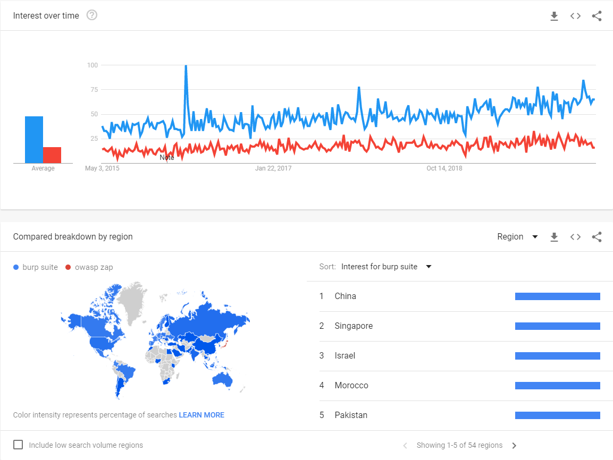

# Burp Suite vs OWASP ZAP

## Introduction
Both OWASP ZAP and Burp Suite are considered intercepting proxies (on steroids) that sits between the browser and the webserver to intercept and manipulate requests exchange.

OWASP ZAP is a free and open-source project actively maintained by volunteers while Burp Suite is a commercial Product maintained and sold by PortSwigger, They have been selected almost on every top 10 tools of the year, and in this post, I will compare version 2020.x of burp suite which saw the first release on January 2020.

We can see since they emerged to the market, they are gaining more and more momentum and users as we see in google trends for the past 5 years (2015-2020). Hopefully, by the end of this post, you will get a better understanding of their similarities and differences.

## Trends between 2015 and 2020
Google Trends showing Burp suite in blue and OWASP ZAP in Red
I will discuss the differences between both tools in regards to the following aspects:

## Describing the User Interface
Listing capabilities and features for both tools
Personal User Experience with each one of them
Pros and Cons of each tool

### 1. User Interface
The user interface can be frustrating when you first see it. Still, after a while, it gets intuitive and has all the necessary info you need to know. Both tools have 6 simple items in their interface.

Burp Suite has a simple interface consisting of 6 simple windows.

#### Burp Suite 2020.2.1 User Interface
- Menu Bar – Provides navigation menus and tools settings
- Tabs Bar -Provides most of the functionality of burp in simple tabs
- Status Bar – Provides information for memory and disk space used by burp (new handy feature)
- Event Log – Provides a log for Burp Suite containing additional information
- Issues and Vulnerabilities window – Provides a list of detected vulnerabilities and is Active on a paid version of Burp Suite Pro or Enterprise
- Tasks menu – Provides simple information and control over current running, paused and finished tasks

While Zap has a simple interface consisting of also 6 simple items

#### ZAP 1.8.0 user interface
- Menu Bar – Provides access to many of the automated and manual tools.
- Toolbar – Includes buttons that provide easy access to most commonly used features.
- Tree Window – Displays the Sites tree and the Scripts tree.
- Workspace Window – Displays requests, responses, and scripts and allows you to edit them.
- Information Window – Displays details of the automated and manual tools.
- Footer – Displays a summary of the alerts found and the status of the main automated tools.

### 2. Capabilities
Both burp suite and Zap have good sets of capabilities; however, at some, a tool can excel more than the other, we will get to each one further down in separate posts.

- Intercepting feature with SSL/TLS support and web sockets.
- Interception History.
- Tree navigation for scope.
- Scope definition.
- Manual request editor and sender.
- Plugins, Extensions, and Marketplace/Store.
- Vulnerability tree or Issues display.
- Fuzzer capabilities with default lists.
- Scan Policy configuration.
- Report generation capability.
- Encoders and Decoders.
- Spider function.
- Auto check for Update features.
- Save and Load Project files.
- Exposed and usable APIs .
- Passive and Active scan engine.
- Session Token entropy Analysis (Burp Only if you know that ZAP support this even with Addons please leave a comment).
- Knowledge Base (Burp only, as ZAP does not support that in the UI).
- Diff-like capability or comparison feature (Burp only AFAIK no support out of the box for ZAP).
- Support for multiple programming and scripting languages.
- Authentication Modules like NTLM, form authentication, and so on.

I might have missed some features so please if you know a feature I missed, please comment below.

### 3. User experience
A while back, I had to use both tools for comparison, While I am used to Burp Suite more from the first look, OWASP ZAP does the same functionality but has to be enhanced with plugins. keep in mind there is an easy learning curve for both.
For example, ZAP has one fuzzer window, which makes it harder to search in fuzzer results, especially when you run multiple fuzzers. At the same time, burp has different windows and configuration for each fuzz conducted. the same goes for other features.
Unlike Burp, You can’t change (add, edit or remove) HTTP headers in ZAP fuzzer window. That gives Burp an edge because it allows you to sort or search in fuzzing results faster and effectively.

One big plus for Burp is the Comparer tab, it allows for easier change detection. Like detecting differences in size from time change or tokens and content, ZAP lacks this feature without extensions (comment bellow which ZAP plugin does that).

Another hurdle in ZAP is the ability to search for text in the request or server response, unlike Burp, which makes it more accessible. You can search for text or regex.

Burp Repeater can replay request/responses

#### Zap request Editor
One more thing that makes Burp more popular than Zap is the ability to detect token entropy and randomness for cryptography analysis. Very useful when session cookies are generated manually.

Burp Sequencer run statistics on tokens and calculates Entropy
However, One big plus for Zap is its API, which makes for easier integration or automation than Burp. You access the API from the browser or other user agents like curl or SDKs/libraries.

Burp Suite community edition API can only be used to write plugins and extensions, unlike ZAP which can be used on DevOps and/or DevSecOps pipelines.

A new Burp REST API was introduced in 2018 which makes it easier to integrate burp with other tools and workflows.

An example is using the API to spider a host and getting the results, e.g. crawling testphp.vulnweb.com from the console.

This feature makes OWASP ZAP the easiest to integrate into DevSecOps pipelines no matter how big or small is your environment.

#### ZAP API in action
For a while, Only OWASP had good resources to learn about ZAP and web application security, but recently PortSwigger also launched a very good free Web Security academy

4. Cons and Pros of each other
In my experience, ZAP is good when it comes to DevOps/DevSecOps for it’s easier API integration and support. At the same time, Burp is more oriented towards actual vulnerability assessment and penetration testing of web applications.

At the different price points for each tool, it is up to your scenario to decide if more expensive is better. Burp Pro is priced by PortSwigger at 399 USD per user per year, While OWASP ZAP is a free and open-source project under Apache 2.0 License.
