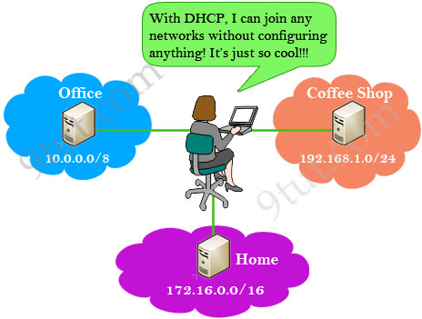
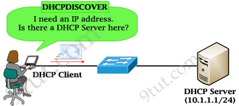
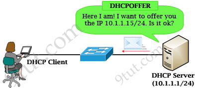
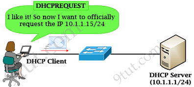
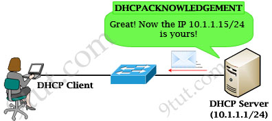
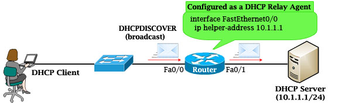

# DHCP
DHCP is a protocol to dynamically assign ip addresses to devices when they join a network for the same time.

In IP environment, before a computer can communicate to another one, they need to have their own IP addresses. There are two ways of configuring an IP address on a device:
- Statically assign an IP address. This means we manually type an IP address for this computer
- Use a protocol so that the computer can obtain its IP address automatically (dynamically). The most popular protocol nowadays to do this is called Dynamic Host Configuration Protocol (DHCP) and we will learn about it in this tutorial.

For example you go to a coffee shop, with DHCP enabled on your computer, you can go online without doing anything. Next day you go online at your school and you don’t have to configure anything either even though the networks of the coffee shop and your school are different (for example, the network of the coffee shop is 192.168.1.0/24 while that of your company is 10.0.0.0/8). Without DHCP, you have to ask someone who knows about the networks at your location then manually choosing an IP address in that range. In bad situation, your chosen IP can be same as someone else who is also using that network and an address conflict may occur. So how can DHCP obtain an suitable IP address for you automatically? Let’s find out.

## How DHCP works

1. When a client boots up for the first time (or try to join a new network), it needs to obtain an IP address to communicate. So it first transmits a DHCPDISCOVER message on its local subnet. Because the client has no way of knowing the subnet to which it belongs, the DHCPDISCOVER is an all-subnets broadcast (destination IP address of 255.255.255.255, which is a layer 3 broadcast address) and a destination MAC address of FF-FF-FF-FF-FF-FF (which is a layer 2 broadcast address). The client does not have a configured IP address, so the source IP address of 0.0.0.0 is used. The purpose of DHCPDISCOVER message is to try to find out a DHCP Server (a server that can assign IP addresses).

2. After receiving the discover message, the DHCP Server will dynamically pick up an unassigned IP address from its IP pool and broadcast a DHCPOFFER message to the client(*). DHCPOFFER message could contain other information such as subnet mask, default gateway, IP address lease time, and domain name server (DNS).

(*)Note: In fact, the DHCPOFFER is a layer 3 broadcast message (the IP destination is 255.255.255.255) but a layer 2 unicast message (the MAC destination is the MAC of the DHCP Client, not FF-FF-FF-FF-FF-FF). So in some books they may say it is a broadcast or unicast message.

3. If the client accepts the offer, it then broadcasts a DHCPREQUEST message saying it will take this IP address. It is called request message because the client might deny the offer by requesting another IP address. Notice that DHCPREQUEST message is still a broadcast message because the DHCP client has still not received an acknowledged IP. Also a DHCP Client can receive DHCPOFFER messages from other DHCP Servers so sending broadcast DHCPREQUEST message is also a way to inform other offers have been rejected.

4. When the DHCP Server receives the DHCPREQUEST message from the client, the DHCP Server accepts the request by sending the client a unicast DHCPACKNOWLEDGEMENT message (DHCPACK).

In conclusion there are four messages sent between the DHCP Client and DHCP Server: DHCPDISCOVER, DHCPOFFER, DHCPREQUEST and DHCPACKNOWLEDGEMENT. This process is often abbreviated as DORA (for Discover, Offer, Request, Acknowledgement).

After receiving DHCPACKNOWLEDGEMENT, the IP address is leased to the DHCP Client. A client will usually keep the same address by periodically contacting the DHCP server to renew the lease before the lease expires.

If the DHCP Server is not on the same subnet with the DHCP Client, we need to configure the router on the DHCP client side to act as a DHCP Relay Agent so that it can forward DHCP messages between the DHCP Client & DHCP Server. To make a router a DHCP Relay Agent, simply put the “ip helper-address <IP-address-of-DHCP-Server>” command under the interface that receives the DHCP messages from the DHCP Client.

As we know, router does not forward broadcast packets (it drops them instead) so DHCP messages like DHCPDISCOVER message will be dropped. But with the “ip helper-address …” command, the router will accept that broadcast message and cover it into a unicast packet and forward it to the DHCP Server. The destination IP address of the unicast packet is taken from the “ip helper-address …” command.

## When a DHCP address conflict occurs

During the IP assignment process, the DHCP Server uses ping to test the availability of an IP before issuing it to the client. If no one replies then the DHCP Server believes that IP has not been allocated and it can safely assign that IP to a client. If someone answers the ping, the DHCP Server records a conflict, the address is then removed from the DHCP pool and it will not be assigned to a client until the administrator resolves the conflict manually.

# Bootp

Bootstrap Protocol (BOOTP) is a networking protocol which is used by networking administration to give IP addresses to each member of that network for participating with other networking devices by the main server.

## Important Features of Bootstrap Protocol :
Here, we will discuss the features of Bootstrap Protocol as follows.

- Bootstrap Protocol (BOOTP) is a basic protocol that automatically provides each participant in a network connection with a unique IP address for identification and authentication as soon as it connects to the network. This helps the server to speed up data transfers and connection requests.

- BOOTP uses a unique IP address algorithm to provide each system on the network with a completely different IP address in a fraction of a second.

- This shortens the connection time between the server and the client. It starts the process of downloading and updating the source code even with very little information.

- BOOTP uses a combination of DHCP (Dynamic Host Configuration Protocol) and UDP (User Datagram Protocol) to request and receive requests from various network-connected participants and to handle their responses.

- In a BOOTP connection, the server and client just need an IP address and a gateway address to establish a successful connection. Typically, in a BOOTP network, the server and client share the same LAN, and the routers used in the network must support BOOTP bridging.

- A great example of a network with a TCP / IP configuration is the Bootstrap Protocol network. Whenever a computer on the network asks for a specific request to the server, BOOTP uses its unique IP address to quickly resolve them.

# How Bootstrap Protocol differs from DHCP
DHCP network servers have much broader use than a BOOTP network server. It may be used for the purpose when a user gives request to the server for a particular IP address and it gives the response of that particular IP address only, hence, time is not wasted for monitoring other addresses. BOOTP uses UDP (User Datagram Protocol) through an IPv4 address connection to identify and authenticate each network user. Also, a BOOTP connection has a stable static database of IP addresses which serves the client immediately with the required IP address.

# Working of Bootstrap Protocol
Here, we will discuss the Working steps of Bootstrap Protocol as follows.

- At the very beginning, each network participant does not have an IP address. The network administrator then provides each host on the network with a unique IP address using the IPv4 protocol.

- The client installs the BOOTP network protocol using TCP / IP Intervention on its computer system to ensure compatibility with all network protocols when connected to this network.

- The BOOTP network administrator then sends a message that contains a valid unicast address. This unicast address is then forwarded to the BOOTP client by the master server.
