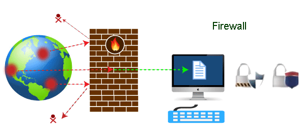
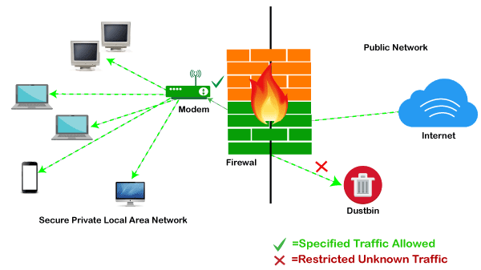

Firewall Tutorial
=================

Nowadays, it is a big challenge to protect our sensitive data from unwanted and unauthorized sources. There are various tools and devices that can provide different security levels and help keep our private data secure. One such tool is a 'firewall' that prevents unauthorized access and keeps our computers and data safe and secure.

In this article, we have talked about firewalls as well as other related topics, such as why we need firewalls, functions of firewalls, limitations of firewalls, working of firewalls, etc.

What is a Firewall?
-------------------

A firewall can be defined as a special type of network security device or a software program that monitors and filters incoming and outgoing network traffic based on a defined set of security rules. It acts as a barrier between internal private networks and external sources (such as the public Internet).

The primary purpose of a firewall is to allow non-threatening traffic and prevent malicious or unwanted data traffic for protecting the computer from viruses and attacks. A firewall is a cybersecurity tool that filters network traffic and helps users block malicious software from accessing the internet in infected computers.

Firewall: Hardware or Software
------------------------------

This is one of the most problematic questions whether a firewall is a hardware or software. As stated above, a firewall can be a network security device or a software program on a computer. This means that the firewall comes at both levels, i.e., hardware and software, though it's best to have both.

Each format (a firewall implemented as hardware or software) has different functionality but the same purpose. A hardware firewall is a physical device that attaches between a computer network and a gateway. For example, a broadband router. On the other hand, a software firewall is a simple program installed on a computer that works through port numbers and other installed software.

Apart from that, there are cloud-based firewalls. They are commonly referred to as FaaS (firewall as a service). A primary advantage of using cloud-based firewalls is that they can be managed centrally. Like hardware firewalls, cloud-based firewalls are best known for providing perimeter security.

Why Firewall
------------

Firewalls are primarily used to prevent malware and network-based attacks. Additionally, they can help in blocking application-layer attacks. These firewalls act as a gatekeeper or a barrier. They monitor every attempt between our computer and another network. They do not allow data packets to be transferred through them unless the data is coming or going from a user-specified trusted source.

Firewalls are designed in such a way that they can react quickly to detect and counter-attacks throughout the network. They can work with rules configured to protect the network and perform quick assessments to find any suspicious activity. In short, we can point to the firewall as a traffic controller.

Some of the important risks of not having a firewall are:

### Open Access

If a computer is running without a firewall, it is giving open access to other networks. This means that it is accepting every kind of connection that comes through someone. In this case, it is not possible to detect threats or attacks coming through our network. Without a firewall, we make our devices vulnerable to malicious users and other unwanted sources.

### Lost or Comprised Data

Without a firewall, we are leaving our devices accessible to everyone. This means that anyone can access our device and have complete control over it, including the network. In this case, cybercriminals can easily delete our data or use our personal information for their benefit.

### Network Crashes

In the absence of a firewall, anyone could access our network and shut it down. It may lead us to invest our valuable time and money to get our network working again.

Therefore, it is essential to use firewalls and keep our network, computer, and data safe and secure from unwanted sources.

Brief History of Firewall
-------------------------

Firewalls have been the first and most reliable component of defense in network security for over 30 years. Firewalls first came into existence in the late 1980s. They were initially designed as packet filters. These packet filters were nothing but a setup of networks between computers. The primary function of these packet filtering firewalls was to check for packets or bytes transferred between different computers.

Firewalls have become more advanced due to continuous development, although such packet filtering firewalls are still in use in legacy systems.

As the technology emerged, Gil Shwed from Check Point Technologies introduced the first stateful inspection firewall in 1993. It was named as FireWall-1. Back in 2000, Netscreen came up with its purpose-built firewall 'Appliance'. It gained popularity and fast adoption within enterprises because of increased internet speed, less latency, and high throughput at a lower cost.

The turn of the century saw a new approach to firewall implementation during the mid-2010. The 'Next-Generation Firewalls' were introduced by the Palo Alto Networks. These firewalls came up with a variety of built-in functions and capabilities, such as Hybrid Cloud Support, Network Threat Prevention, Application and Identity-Based Control, and Scalable Performance, etc. Firewalls are still getting new features as part of continuous development. They are considered the first line of defense when it comes to network security.

How does a firewall work?
-------------------------

A firewall system analyzes network traffic based on pre-defined rules. It then filters the traffic and prevents any such traffic coming from unreliable or suspicious sources. It only allows incoming traffic that is configured to accept.

Typically, firewalls intercept network traffic at a computer's entry point, known as a port. Firewalls perform this task by allowing or blocking specific data packets (units of communication transferred over a digital network) based on pre-defined security rules. Incoming traffic is allowed only through trusted IP addresses, or sources.

Functions of Firewall
---------------------

As stated above, the firewall works as a gatekeeper. It analyzes every attempt coming to gain access to our operating system and prevents traffic from unwanted or non-recognized sources.

Since the firewall acts as a barrier or filter between the computer system and other networks (i.e., the public Internet), we can consider it as a traffic controller. Therefore, a firewall's primary function is to secure our network and information by controlling network traffic, preventing unwanted incoming network traffic, and validating access by assessing network traffic for malicious things such as hackers and malware.

Generally, most operating systems (for example - Windows OS) and security software come with built-in firewall support. Therefore, it is a good idea to ensure that those options are turned on. Additionally, we can configure the security settings of the system to be automatically updated whenever available.

Firewalls have become so powerful, and include a variety of functions and capabilities with built-in features:

-   Network Threat Prevention
-   Application and Identity-Based Control
-   Hybrid Cloud Support
-   Scalable Performance
-   Network Traffic Management and Control
-   Access Validation
-   Record and Report on Events

Limitations of Firewall
-----------------------

When it comes to network security, firewalls are considered the first line of defense. But the question is whether these firewalls are strong enough to make our devices safe from cyber-attacks. The answer may be "no". The best practice is to use a firewall system when using the Internet. However, it is important to use other defense systems to help protect the network and data stored on the computer. Because cyber threats are continually evolving, a firewall should not be the only consideration for protecting the home network.

The importance of using firewalls as a security system is obvious; however, firewalls have some limitations:

-   Firewalls cannot stop users from accessing malicious websites, making it vulnerable to internal threats or attacks.
-   Firewalls cannot protect against the transfer of virus-infected files or software.
-   Firewalls cannot prevent misuse of passwords.
-   Firewalls cannot protect if security rules are misconfigured.
-   Firewalls cannot protect against non-technical security risks, such as social engineering.
-   Firewalls cannot stop or prevent attackers with modems from dialing in to or out of the internal network.
-   Firewalls cannot secure the system which is already infected.

Therefore, it is recommended to keep all Internet-enabled devices updated. This includes the latest operating systems, web browsers, applications, and other security software (such as anti-virus). Besides, the security of wireless routers should be another practice. The process of protecting a router may include options such as repeatedly changing the router's name and password, reviewing security settings, and creating a guest network for visitors.

Types of Firewall
-----------------

Depending on their structure and functionality, there are different types of firewalls. The following is a list of some common types of firewalls:

-   Proxy Firewall
-   Packet-filtering firewalls
-   Stateful Multi-layer Inspection (SMLI) Firewall
-   Unified threat management (UTM) firewall
-   Next-generation firewall (NGFW)
-   Network address translation (NAT) firewalls

Difference between a Firewall and Anti-virus
--------------------------------------------

Firewalls and anti-viruses are systems to protect devices from viruses and other types of Trojans, but there are significant differences between them. Based on the vulnerabilities, the main differences between firewalls and anti-viruses are tabulated below:

# References
https://www.javatpoint.com/firewall
