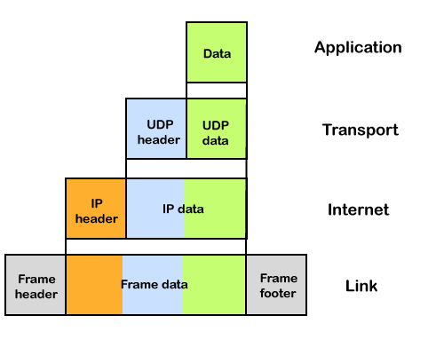
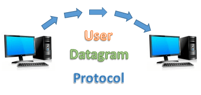

# Internet Protocol (IP)

Here, IP stands for internet protocol. It is a protocol defined in the TCP/IP model used for sending the packets from source to destination. The main task of IP is to deliver the packets from source to the destination based on the IP addresses available in the packet headers. IP defines the packet structure that hides the data which is to be delivered as well as the addressing method that labels the datagram with a source and destination information.

An IP protocol provides the connectionless service, which is accompanied by two transport protocols, i.e., TCP/IP and UDP/IP, so internet protocol is also known as TCP/IP or UDP/IP.

The first version of IP (Internet Protocol) was IPv4. After IPv4, IPv6 came into the market, which has been increasingly used on the public internet since 2006.

### History of Internet Protocol

The development of the protocol gets started in 1974 by Bob Kahn and Vint Cerf. It is used in conjunction with the Transmission Control Protocol (TCP), so they together named the TCP/IP.

The first major version of the internet protocol was IPv4, which was version 4. This protocol was officially declared in RFC 791 by the Internet Engineering Task Force (IETF) in 1981.

After IPv4, the second major version of the internet protocol was IPv6, which was version 6. It was officially declared by the IETF in 1998. The main reason behind the development of IPv6 was to replace IPv4. There is a big difference between IPv4 and IPv6 is that IPv4 uses 32 bits for addressing, while IPv6 uses 128 bits for addressing.

### Function

The main function of the internet protocol is to provide addressing to the hosts, encapsulating the data into a packet structure, and routing the data from source to the destination across one or more IP networks. In order to achieve these functionalities, internet protocol provides two major things which are given below.

An internet protocol defines two things:

-   Format of IP packet
-   IP Addressing system

### What is an IP packet?

Before an IP packet is sent over the network, two major components are added in an IP packet, i.e., header and a payload.



An IP header contains lots of information about the IP packet which includes:

-   Source IP address: The source is the one who is sending the data.
-   Destination IP address: The destination is a host that receives the data from the sender.
-   Header length
-   Packet length
-   TTL (Time to Live): The number of hops occurs before the packet gets discarded.
-   Transport protocol: The transport protocol used by the internet protocol, either it can be TCP or UDP.

There is a total of 14 fields exist in the IP header, and one of them is optional.

Payload: Payload is the data that is to be transported.

### How does the IP routing perform?

IP routing is a process of determining the path for data so that it can travel from the source to the destination. As we know that the data is divided into multiple packets, and each packet will pass through a web of the router until it reaches the final destination. The path that the data packet follows is determined by the routing algorithm. The routing algorithm considers various factors like the size of the packet and its header to determine the efficient route for the data from the source to the destination. When the data packet reaches some router, then the source address and destination address are used with a routing table to determine the next hop's address. This process goes on until it reaches the destination. The data is divided into multiple packets so all the packets will travel individually to reach the destination.

For example, when an email is sent from the email server, then the TCP layer in this email server divides the data into multiple packets, provides numbering to these packets and transmits them to the IP layer. This IP layer further transmits the packet to the destination email server. On the side of the destination server, the IP layer transmits these data packets to the TCP layer, and the TCP layer recombines these data packets into the message. The message is sent to the email application.

### What is IP Addressing?

An IP address is a unique identifier assigned to the computer which is connected to the internet. Each IP address consists of a series of characters like 192.168.1.2. Users cannot access the domain name of each website with the help of these characters, so DNS resolvers are used that convert the human-readable domain names into a series of characters. Each IP packet contains two addresses, i.e., the IP address of the device, which is sending the packet, and the IP address of the device which is receiving the packet.

Types of IP addresses

IPv4 addresses are divided into two categories:

-   Public address
-   Private address

### Public address

The public address is also known as an external address as they are grouped under the WAN addresses. We can also define the public address as a way to communicate outside the network. This address is used to access the internet. The public address available on our computer provides the remote access to our computer. With the help of a public address, we can set up the home server to access the internet. This address is generally assigned by the ISP (Internet Service Provider).

Key points related to public address are:

-   The scope of the public address is global, which means that we can communicate outside the network.
-   This address is assigned by the ISP (Internet Service Provider).
-   It is not available at free of cost.
-   We can get the Public IP by typing on Google "What is my IP".

### Private address

A private address is also known as an internal address, as it is grouped under the LAN addresses. It is used to communicate within the network. These addresses are not routed on the internet so that no traffic can come from the internet to this private address. The address space for the private address is allocated using InterNIC to create our own network. The private addresses are assigned to mainly those computers, printers, smartphones, which are kept inside the home or the computers that are kept within the organization. For example, a private address is assigned to the printer, which is kept inside our home, so that our family member can take out the print from the printer.

If the computer is assigned with a private address, then the devices available within the local network can view the computer through the private ip address. However, the devices available outside the local network cannot view the computer through the private IP address, but they can access the computer if they know the router's public address. To access the computer directly, NAT (Network Address Translator) is to be used.

Key points related to private address are:

-   Its scope is local, as we can communicate within the network only.
-   It is generally used for creating a local area network.
-   It is available at free of cost.
-   We can get to know the private IP address by simply typing the "ipconfig" on the command prompt.

# TCP/IP: Transmission Control Protocol/Internet Protocol

TCP/IP stands for Transmission Control Protocol/Internet Protocol. It is a set of protocols or rules and procedures that governs communications among computers on the internet. Although the entire internet protocol suite is commonly known as TCP/IP, it is one of the core protocols of the Internet Protocol Suite. It was developed in 1978 and driven by Vint Cerf and Bob Kahn.


TCP/IP is a commonly used standard for transmitting data over networks. In simple words, it is the suite of communication protocols which connect network devices on the internet or used to interconnect network devices on the internet. It decides how the data will be exchanged over the internet through end-to-end communications that include how the data should be arranged into packets (bundles of information), addressed, sent, and received at the destination. This communication protocol can also be used to interconnect network devices in a private network such an intranet or an extranet.

### How TCP/IP works?

As the name suggests, TCP/IP comprises two basic protocols: TCP (transmission control protocol) and IP (Internet protocol).

TCP: The TCP allows applications to create channels of communications across a network. It also allows a message to be divided into smaller packets before they are transmitted over the internet and then assembled in the right manner at the destination address. So, it ensures the reliable transmission of data across the network. Furthermore, it also checks errors in the packets and requests for re-transmission if errors are found.

IP: The IP address tells the packets the address and route so that they reach the right destination. It has a method that enables gateway computers on the internet-connected network forward the message after checking the IPS address. It is like a line of workers passing coal from a mine to a mining cart.

UDP: User Datagram Protocol
---------------------------

UDP stands for User Datagram Protocol. It is a Transport Layer Protocol, which is a part of the Internet Protocol Suite and an alternative communication protocol to Transmission Control Protocol (TCP). Both UDP and TCP are transparent layers protocols which are used on the Internet or run on the top of the Internet Protocol (IP) and commonly known as UDP/IP and TCP/IP, respectively.

Out of these two, the UDP is the simplest transport layer protocol designed to send data over the Internet. It picks the datagram from the network layer and attaches the header then forwards it to the user.



Characteristics of UDP:
-----------------------

-   It is a fast, unreliable, and stateless protocol that makes it suitable for use with applications that can tolerate lost data.
-   It can be used for transaction-based protocols, such as DNS or Network Time Protocol NTP.
-   It can be used for settings where many clients are connected and where real-time error correction is not must, such as gaming, voice calls, or video conferencing, and streaming videos.
-   It is a connectionless protocol as it doesn?t need a virtual circuit before transferring the data.
-   It offers minimal transport service, in-order delivery is not certain, and a congestion control mechanism is also not provided.

Furthermore, UDP uses headers to transfer data over connections. Its headers contain a set of parameters called fields. A UDP header has four fields which are as follows:

1.  Source Port: It is a 2 Byte field that tells the port number of a source.
2.  Destination Port: It is also a 2 Byte long filed that tells the port number of the destination.
3.  Length: It is the total length of the UDP, including the header and the data. It is a 16-bits field.
4.  Checksum: It is a 2 Byte long field that is used to check errors, e.g., it is used in IPv6 and sometimes in IPv4.

How UDP Works:
--------------

UDP sends a datagram (data unit) from one computer to another using the Internet Protocol. UDP encapsulates the data in a UDP packet and adds its header information to the packet. The data comprises source port, destination port, the packet length, and a checksum. After the UPD packets are encapsulated in an Internet Protocol packet, they start moving to their destinations.

Applications of UDP:
--------------------

-   It is used for simple request-response communication where data is less and which require one response for one request, and not much concerned with flow and error control. e.g., DNS
-   UDP can be used for multicasting as it supports packet switching.
-   It can be used by routing protocols such as RIP and OSPF as they transmit less data.
-   It is used by Trivial File Transfer Protocol (TFTP) to send small files.
-   It is used by multicasting and broadcasting applications.
-   It can be used by streaming media like video conferencing as they prefer speed over reliability.
-   Chatting, online games, and similar real-time applications use UDP.
-   Management protocols like SNMP (Simple Network Management Protocol), and Bootp or DHCP also use UDP
-   Furthermore, there are various protocols that use UDP, such as Kerberos, Network Time Protocol (NTP), Network News Protocol (NNP), etc.


# IPv6

IP address is your digital identity. It's a network address for your computer so the Internet knows where to send you emails, data, etc.

> IP address determines who and where you are in the network of billions of digital devices that are connected to the Internet.

IPv6 or Internet Protocol Version 6 is a network layer protocol that allows communication to take place over the network. IPv6 was designed by Internet Engineering Task Force (IETF) in December 1998 with the purpose of superseding the IPv4 due to the global exponentially growing internet users.

#### IPv4 vs IPv6

The common type of IP address (is known as IPv4, for "version 4"). Here's an example of what an IP address might look like:
```
25.59.209.224
```
An IPv4 address consists of four numbers, each of which contains one to three digits, with a single dot (.) separating each number or set of digits. Each of the four numbers can range from 0 to 255. This group of separated numbers creates the addresses that let you and everyone around the globe to send and retrieve data over our Internet connections. The IPv4 uses a 32-bit address scheme allowing to store 2^32 addresses which is more than 4 billion addresses. To date, it is considered the primary Internet Protocol and carries 94% of Internet traffic. Initially, it was assumed it would never run out of addresses but the present situation paves a new way to IPv6, let's see why? An IPv6 address consists of eight groups of four hexadecimal digits. Here's an example IPv6 address:
```
3001:0da8:75a3:0000:0000:8a2e:0370:7334
```
This new IP address version is being deployed to fulfil the need for more Internet addresses. It was aimed to resolve issues which are associated with IPv4. With 128-bit address space, it allows 340 undecillion unique address space. IPv6 also called IPng (Internet Protocol next generation).

> IPv6 support a theoretical maximum of 340, 282, 366, 920, 938, 463, 463, 374, 607, 431, 768, 211, 456. To keep it straightforward, we will never run out of IP addresses again.

#### Types of IPv6 Address

Now that we know about what is IPv6 address let's take a look at its different types.

-   **Unicast addresses** It identifies a unique node on a network and usually refers to a single sender or a single receiver.
-   **Multicast addresses** It represents a group of IP devices and can only be used as the destination of a datagram.
-   **Anycast addresses** It is assigned to a set of interfaces that typically belong to different nodes.

#### Advantages of IPv6

-   Reliability
-   **Faster Speeds:** IPv6 supports multicast rather than broadcast in IPv4.This feature allows bandwidth-intensive packet flows (like multimedia streams) to be sent to multiple destinations all at once.
-   **Stronger Security:** IPSecurity, which provides confidentiality, and data integrity, is embedded into IPv6.
-   Routing efficiency
-   Most importantly it's the final solution for growing nodes in Global-network.

#### Disadvantages of IPv6

-   **Conversion:** Due to widespread present usage of IPv4 it will take a long period to completely shift to IPv6.
-   **Communication:** IPv4 and IPv6 machines cannot communicate directly with each other. They need an intermediate technology to make that possible.

## Local Broadcast Address
Local Broadcast Address is used to communicate with all the devices on a local network. It is represented by

255.255.255.255 or 11111111.11111111.11111111.11111111 in binary.

A broadcast address is used by hosts to request IP addresses from the DHCP(Dynamic Host Configuration Protocol) server. The host sends a broadcast to the broadcast address to request an IP address and in turn the DHCP server allocates an IP address from the pool of IP addresses.
By default, local broadcast address is always dropped by routers and layer 3 switches; but one can always override this by configuring the device with DHCP forwarding or DHCP relay.

## Local Loopback Address
Local Loopback Address is used to let a system send a message to itself to make sure that TCP/IP stack is installed correctly on the machine.
In IPv4, IP addresses that start with decimal 127 or that has 01111111 in the first octet are loopback addresses(127.X.X.X). Typically 127.0.0.1 is used as the local loopback address.
This leads to the wastage of many potential IP addresses. But in IPv6 ::1 is used as local loopback address and therefore there isn’t any wastage of addresses.

# References
https://www.javatpoint.com/ip
https://www.javatpoint.com/tcp-ip-full-form
https://www.javatpoint.com/udp-full-form
