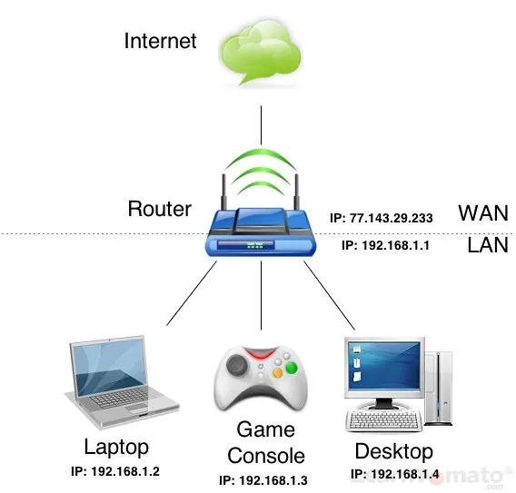
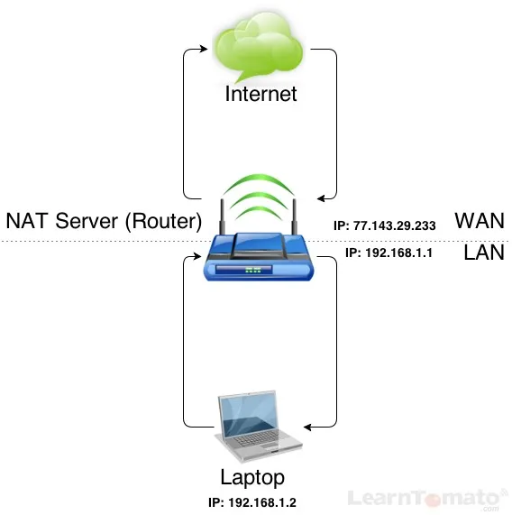

LAN vs WAN vs NAT
==========================================

If you plan to perform any kind of computer networking, there are two acronyms you need to become keenly familiar with: LAN and WAN (you'll see these terms a lot).

-   **LAN** = Local Area Network
-   **WAN** = Wide Area Network

### What is LAN?

A** Local Area Network** (LAN) is a computer network that spans a relatively small area such as residential homes and small office buildings. A LAN inside of your home/office may include: a router, desktop computer, laptop, tablet, printer, game console, etc. Each device within your LAN must have an [IP address](https://learntomato.flashrouters.com/what-is-an-ip-address-static-ip-vs-dynamic-ip/ "What is an IP Address? Static IP vs. Dynamic IP") to communicate with other devices across your local network and throughout the entire Internet. LAN's are mainly used to share data and peripherals such as printers.

### What is WAN?

A **Wide Area Network** (WAN) refers to a network that covers a broad geographic area (metropolitan area, state, region, etc). Essentially, a WAN refers to networks outside of a Local Area Network (LAN). In most cases, WAN refers to the Internet network itself. But that is not always the case. In fact, a small scale WAN can be developed by creating many Local Area Networks (LAN's).

Study the image below. Carefully look at the IP addresses. You should notice a pattern among the IP addresses within the Local Area Network (LAN).

LAN / WAN

You may have noticed that each device within the LAN has an IP address that begins with 192.168.1.x. You may have also noticed that the router has two IP addresses, one on each side of the dotted line, which leads us to the following question:

### Why does a router have two IP addresses?

That's a great question! And while it deserves a somewhat long (and rather geeky) answer, there is no need to worry -- this will be painless, I promise.

You see, in the corporate world, businesses use what is known as a Network Address Translation (NAT) server; whereas, most small businesses and residential homes use a router. Essentially, they do the same thing, only a router does it on a smaller scale.

The reason the router has two IP addresses, is because there are two types of IP addresses; public and private. In the illustration above, everything in the Wide Area Network (WAN) has a public IP address. Everything on the Local Area Network (LAN) has a private IP address.

For now, think of public IP addresses as a primary phone number of a large corporation. Think of private IP addresses like telephone line extensions.

A **Public IP** address is designed for public access and is accessible by anyone on the Internet. When you visit a website, that website is hosted on server that is associated with a public IP address.

A** Private IP** addresses is used only within your LAN. Therefore, no one can reach your computers private IP address from outside of your Local Area Network.

All traffic coming inbound to your private network (your LAN), must first come through a public IP network address. As a result, anyone can reach the public IP address of your router (on the WAN side) because, well, . . .this is a public IP address! The objective is to hide your private Local Area Network (LAN) behind one single public IP address. This process requires a gateway/router. This is where a NAT server comes into the picture.

### What is NAT?

NAT Servers (routers) have three primary functions:

1.  They route the call to the proper computer.
2.  They privatize devices connected to your LAN. Hence the term "private IP."
3.  They control the type of traffic by directing it through the proper portal (opening).

Since traffic goes in multiple directions (into your LAN, out of your LAN, and within your LAN), the router is charged with the task of making sure that the computer or device that made the outbound call (the request) is the same computer that receives the inbound response.

Computers within your local network can communicate freely. However, traffic coming into your LAN or going out of your LAN requires a technology called Network Address Translation (NAT). NAT allows your computers with private IP addresses to access the public space of the Internet.

Were you born before 1975? Do you remember the days when we had to use telephone operators? Think of a router like a telephone operator.

### Here's how NAT works:

The **NAT server** (router) takes the outbound call from a computer connected to your **LAN**, say, your laptop computer . . .

-   It puts the call request in its memory.
-   It then converts the private IP address to its own public IP address and forwards the request.
-   When a response is returned from the Internet, it searches its memory to see which device made the call and then delivers the packet to the proper computer.

As a result, all outbound requests to the Internet appear as if they're coming from one public IP address. It is very important that you understand this. If you're unclear, please read the last sentence again and then study the illustration below.

NAT Server

**NAT** makes it appear as though every device behind your router is using the same public IP address; when actually, each device within your LAN has its own private IP address.

Let's examine the illustration above:

-   The laptop makes a call to the Internet (the WAN).
-   The Router intercepts the call and saves it to memory (caching which device made the call).
-   The router then translates the Laptop's private IP address into its own public IP address and then forwards the request.
-   When the call is received from the Internet, the router checks its cache to see which private IP address made the request and delivers the packets back to the Laptop.

Additionally, in order to get information from the WAN to your LAN, and to-and-from computers within your LAN, your router must allow traffic to pass through a portal (an opening) in the routers firewall. Different programs use different port numbers. In order for programs to send/receive data through a port in your router, the router must allow it to happen. Opening a port is known as port forwarding.

# References
https://learntomato.flashrouters.com/what-is-lan-wan-nat/
