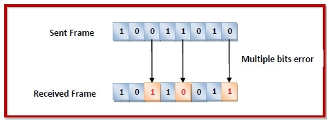

# The OSI Model

The OSI Model (Open Systems Interconnection Model) is a conceptual framework used to describe the functions of a networking system. The OSI model characterizes computing functions into a universal set of rules and requirements in order to support interoperability between different products and software. In the OSI reference model, the communications between a computing system are split into seven different abstraction layers: Physical, Data Link, Network, Transport, Session, Presentation, and Application.

Created at a time when network computing was in its infancy, the OSI was published in 1984 by the International Organization for Standardization (ISO). Though it does not always map directly to specific systems, the OSI Model is still used today as a means to describe Network Architecture. It was the first standard model for network communications, adopted by all major computer and telecommunication companies in the early days. But since then, the simpler TCP/IP model has taken prominence.

## The 7 Layers of the OSI Model

### Physical Layer (Layer 1)
The lowest layer of the OSI Model is concerned with electrically or optically transmitting raw unstructured data *bits* across the network from the physical layer of the sending device to the physical layer of the receiving device.

The major protocols used by this layer include Bluetooth, DSL, IEEE.802.11 (Wifi), IEEE.802.3 (Ethernet). Layer 1 can include specifications such as voltages, pin layout, cabling, and radio frequencies. At the physical layer, one might find “physical” resources such as network hubs, cabling, repeaters, network adapters or modems.

### Data Link Layer (Layer 2)
The data link layer involves the network interface-to-interface transfer of data where the data is packaged into *frames*. The data link layer also corrects errors that may have occurred at the physical layer.

The data link layer encompasses two sub-layers of its own. The first, media access control (MAC), provides flow control and multiplexing for device transmissions over a network. The second, the logical link control (LLC), provides flow and error control over the physical medium as well as identifies line protocols.

The data link layer uses an addressing scheme known as the Media Access Control address, or MAC address. The MAC address uniquely identifies each individual NIC. Each physical/hardware NIC is pre-configured with a MAC address by the manufacturer.

The protocols that are used by the Data Link Layer include: ARP, CSLIP, HDLC, IEEE.802.3 (Ethernet), PPP, X-25, SLIP, ATM, SDLS and PLIP.

### Network Layer (Layer 3)
The Network layer of the OSI model is responsible for managing the logistics of delivering the network *packets* from end to end. This includes techniques for routing the packets through devices like routers and switches. The addressing scheme for the network layer is known as the *Internet Protocol* address, or the IP Address.

The Network Layer assists the following protocols: Internet Protocol (IPv4), Internet Protocol (IPv6), IPX, ICMP, and IPSec (VPN).

### Transport Layer (Layer 4)
The transport layer manages the delivery and error checking of data *packets*. It regulates the size, sequencing, and ultimately the transfer of data between systems and hosts. One of the most common examples of the transport layer is TCP or the Transmission Control Protocol.

The transport layer uses an addressing scheme known as *Port Numbers*. Each network interface has 65,536 ports available. A unique application stream is identified by both a Source and Destination port (in combination with their Source and Destination IP address).

Transport layer protocols include TCP, UDP, SPX, DCCP and SCTP.

### Session Layer (Layer 5)
The session layer controls the conversations between different computers. A session or connection between machines is set up, managed, and termined at layer 5. Session layer services also include authentication and reconnections.

Session Layer protocols include: SSL, PPTP, SAP, L2TP and NetBIOS.

### Presentation Layer (Layer 6)
The presentation layer formats or translates data for the application layer based on the syntax or semantics that the application accepts. Because of this, it at times also called the syntax layer. This layer can also handle the encryption and decryption required by the application layer.

The following are the presentation layer protocols: XDR, TLS, SSL and MIME.

### Application Layer (Layer 7)
At this layer, both the end user and the application layer interact directly with the software application. This layer sees network services provided to end-user applications such as a web browser or Office 365. The application layer identifies communication partners, resource availability, and synchronizes communication.

This layer uses following protocols: HTTP, SMTP, DHCP, FTP, Telnet, SNMP and SMPP. Web browsers (Google Chrome, Firefox, Safari, etc.) TelNet, and FTP, are also examples of communications that rely on Layer 7.

### OSI Model End-To-End
The diagram below shows the end-to-end encapsulation/decapsulation of network data being transmitted from a Sender to a Recipient. Think of this as, what happens between my computer and a web server when I visit their website. However, variations of this process cover how network communication occurs in general across the different OSI layers from top to bottom.

## Error Detection and Correction in Data link Layer (Layer 2)

When bits are transmitted over the computer network, they are subject to get corrupted due to interference and network problems. The corrupted bits leads to spurious data being received by the destination and are called errors.

Errors can be of three types, namely single bit errors, multiple bit errors, and burst errors.

- Single bit error − In the received frame, only one bit has been corrupted, i.e. either changed from 0 to 1 or from 1 to 0.

- Multiple bits error − In the received frame, more than one bits are corrupted.

- Burst error − In the received frame, more than one consecutive bits are corrupted.

### Error Control
Error control can be done in two ways

Error detection − Error detection involves checking whether any error has occurred or not. The number of error bits and the type of error does not matter.

Error correction − Error correction involves ascertaining the exact number of bits that has been corrupted and the location of the corrupted bits.

#### Error Detection Techniques
There are three main techniques for detecting errors in frames: Parity Check, Checksum and Cyclic Redundancy Check (CRC).

#### Parity Check
The parity check is done by adding an extra bit, called parity bit to the data to make a number of 1s either even in case of even parity or odd in case of odd parity.

While creating a frame, the sender counts the number of 1s in it and adds the parity bit in the following way

- In case of even parity: If a number of 1s is even then parity bit value is 0. If the number of 1s is odd then parity bit value is 1.

- In case of odd parity: If a number of 1s is odd then parity bit value is 0. If a number of 1s is even then parity bit value is 1.

On receiving a frame, the receiver counts the number of 1s in it. In case of even parity check, if the count of 1s is even, the frame is accepted, otherwise, it is rejected. A similar rule is adopted for odd parity check.

The parity check is suitable for single bit error detection only.

#### Checksum
In this error detection scheme, the following procedure is applied

- Data is divided into fixed sized frames or segments.

- The sender adds the segments using 1’s complement arithmetic to get the sum. It then complements the sum to get the checksum and sends it along with the data frames.

- The receiver adds the incoming segments along with the checksum using 1’s complement arithmetic to get the sum and then complements it.

- If the result is zero, the received frames are accepted; otherwise, they are discarded.

#### Cyclic Redundancy Check (CRC)
Cyclic Redundancy Check (CRC) involves binary division of the data bits being sent by a predetermined divisor agreed upon by the communicating system. The divisor is generated using polynomials.

- Here, the sender performs binary division of the data segment by the divisor. It then appends the remainder called CRC bits to the end of the data segment. This makes the resulting data unit exactly divisible by the divisor.

- The receiver divides the incoming data unit by the divisor. If there is no remainder, the data unit is assumed to be correct and is accepted. Otherwise, it is understood that the data is corrupted and is therefore rejected.

#### Error Correction Techniques
Error correction techniques find out the exact number of bits that have been corrupted and as well as their locations. There are two principle ways

- Backward Error Correction (Retransmission) −  If the receiver detects an error in the incoming frame, it requests the sender to retransmit the frame. It is a relatively simple technique. But it can be efficiently used only where retransmitting is not expensive as in fiber optics and the time for retransmission is low relative to the requirements of the application.

- Forward Error Correction −  If the receiver detects some error in the incoming frame, it executes error-correcting code that generates the actual frame. This saves bandwidth required for retransmission. It is inevitable in real-time systems. However, if there are too many errors, the frames need to be retransmitted.

# References

https://www.forcepoint.com/cyber-edu/osi-model

https://medium.com/geekculture/understanding-http-protocol-osi-model-ba57cd5bda14

https://www.techopedia.com/definition/24961/osi-protocols

https://www.tutorialspoint.com/error-detection-and-correction-in-data-link-layer
