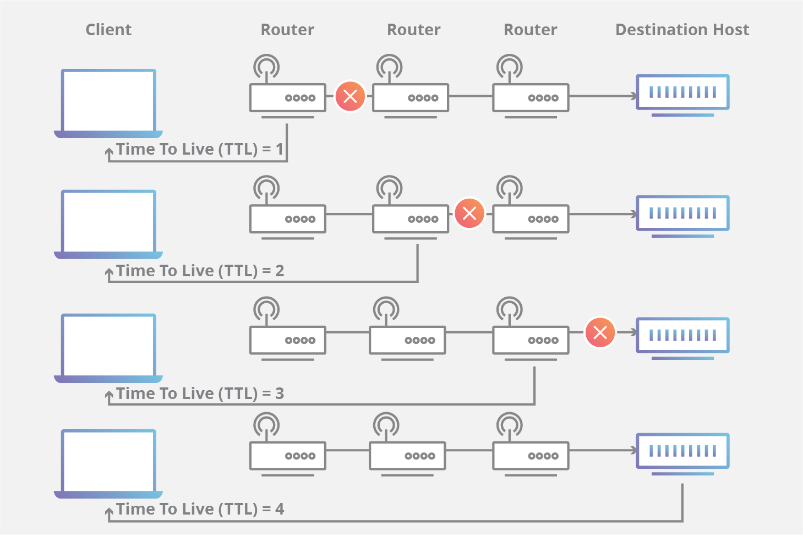

What is time-to-live (TTL) in networking?
-----------------------------------------

Time to live (TTL) refers to the amount of time or "hops" that a packet is set to exist inside a network before being discarded by a router. TTL is also used in other contexts including CDN caching and DNS caching.

How does TTL work?
------------------

When a packet of information is created and sent out across the Internet, there is a risk that it will continue to pass from router to router indefinitely. To mitigate this possibility, packets are designed with an expiration called a time-to-live or hop limit. Packet TTL can also be useful in determining how long a packet has been in circulation, and allow the sender to receive information about a packet's path through the Internet.

Each packet has a place where it stores a numerical value determining how much longer it should continue to move through the network. Every time a router receives a packet, it subtracts one from the TTL count and then passes it onto the next location in the network. If at any point the TTL count is equal to zero after the subtraction, the router will discard the packet and send an ICMP message back to the originating host.

The commonly used network commands ping and traceroute both utilize TTL. When using the traceroute command, a stream of packets with increasingly higher sequential TTLs are sent across the Internet towards a destination. Because each step along the connection is the last stop for one of the packets, each location will return an ICMP message to the sender after discarding the packet. The time it takes for the ICMP message to return to the sender is then used to determine how long it takes to get to each successive hop along the network.

